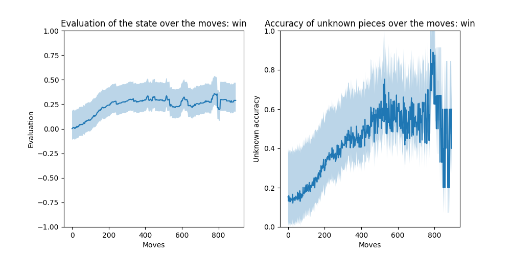
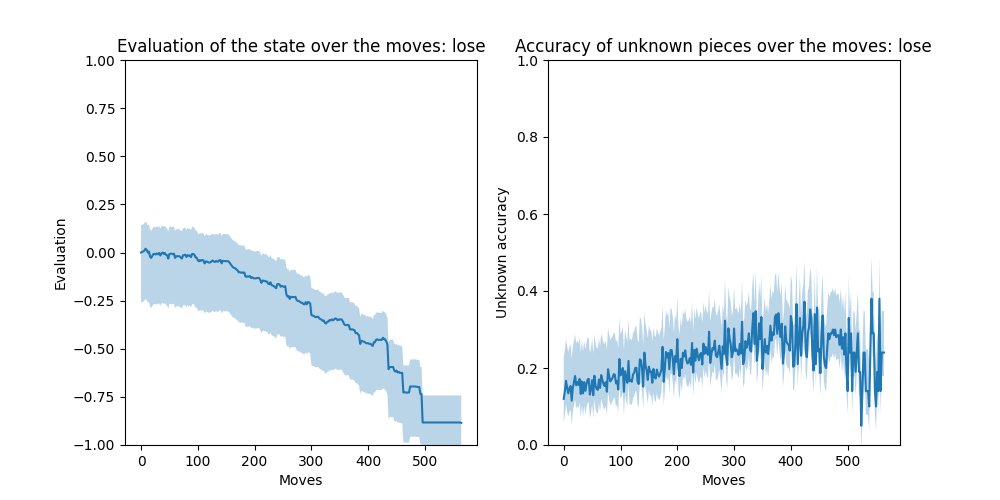
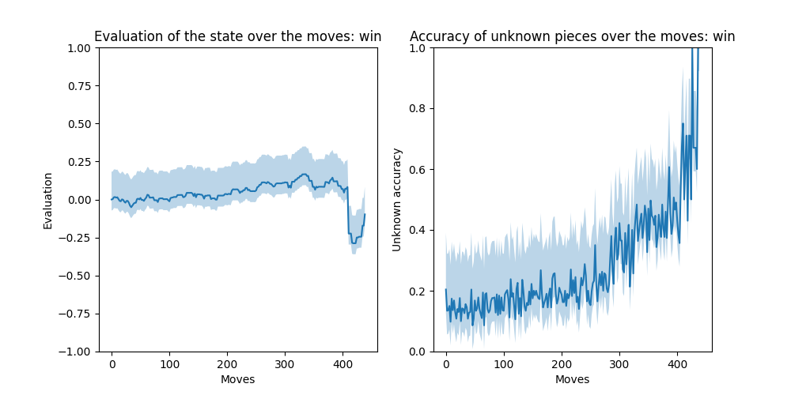
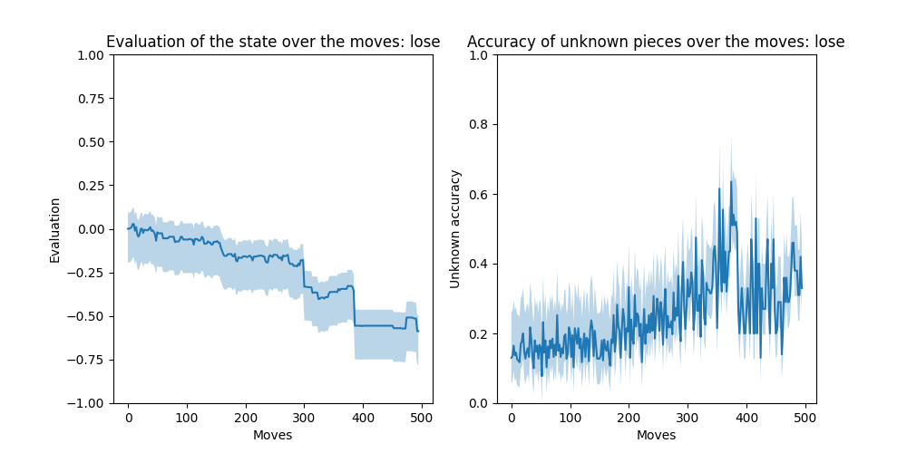
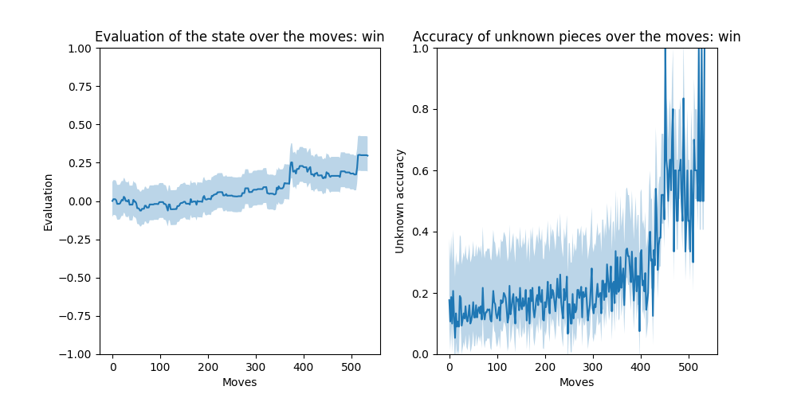
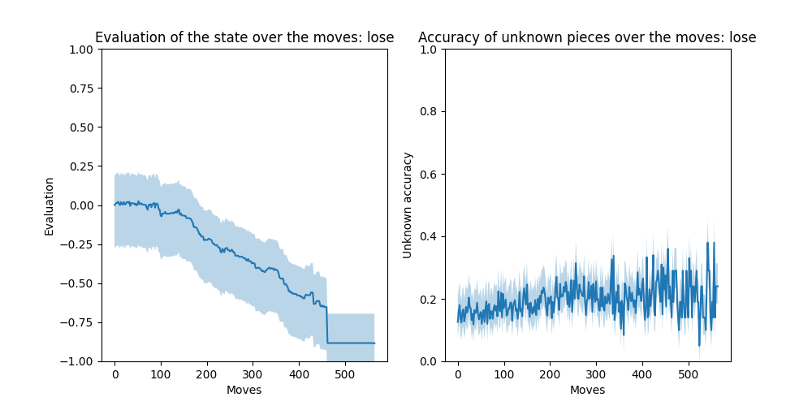
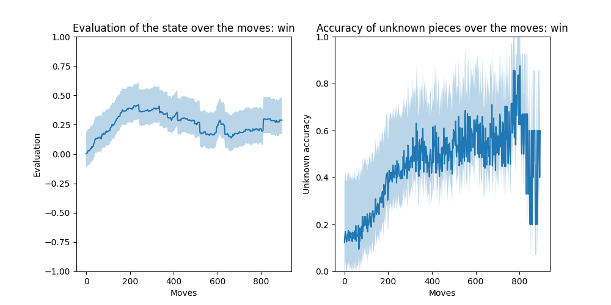
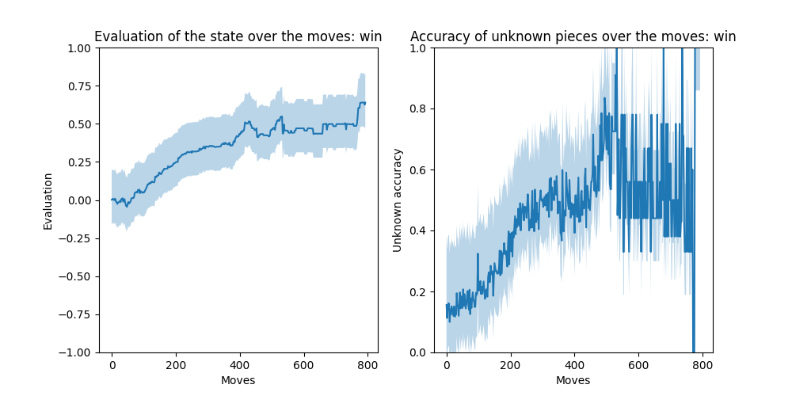
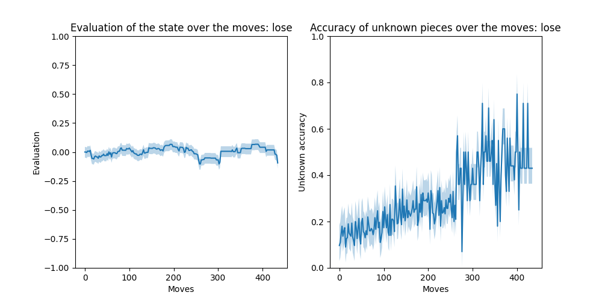

# Changement: benchSmall-Aout/
## Global
Total winrate of custom: 62.5/7.5/30.0
### Evaluation of the state over the moves: win

### Evaluation of the state over the moves: lose

## custom
### Win/Draw/Lose of custom

| ... | custom |
| --- | --- |
| asmodeus | 50/10/40 |
| hunter | 30/20/50 |
| rnad | 100/0/0 |
| mcts | 70/0/30 |
### Other miscellanous stats

| custom | Nbr Games | Avg_time | Avg_moves |
| --- | --- | --- | --- |
| asmodeus | 10 | 293 | 418 |
| hunter | 10 | 346 | 568 |
| rnad | 10 | 470 | 548 |
| mcts | 10 | 802 | 431 |
## asmodeus
### Evaluation of the state over the moves: win

### Evaluation of the state over the moves: lose

### Win/Draw/Lose of asmodeus

| ... | asmodeus |
| --- | --- |
| custom | 40/10/50 |
| hunter | 50/20/30 |
| rnad | 100/0/0 |
| mcts | 40/0/60 |
### Other miscellanous stats

| asmodeus | Nbr Games | Avg_time | Avg_moves |
| --- | --- | --- | --- |
| custom | 10 | 293 | 418 |
| hunter | 10 | 11 | 456 |
| rnad | 10 | 5 | 345 |
| mcts | 10 | 236 | 234 |
## hunter
### Evaluation of the state over the moves: win

### Evaluation of the state over the moves: lose

### Win/Draw/Lose of hunter

| ... | hunter |
| --- | --- |
| custom | 50/20/30 |
| asmodeus | 30/20/50 |
| rnad | 90/0/10 |
| mcts | 80/10/10 |
### Other miscellanous stats

| hunter | Nbr Games | Avg_time | Avg_moves |
| --- | --- | --- | --- |
| custom | 10 | 346 | 568 |
| asmodeus | 10 | 11 | 456 |
| rnad | 10 | 6 | 394 |
| mcts | 10 | 356 | 365 |
## rnad
### Evaluation of the state over the moves: win

### Evaluation of the state over the moves: lose

### Win/Draw/Lose of rnad

| ... | rnad |
| --- | --- |
| custom | 0/0/100 |
| asmodeus | 0/0/100 |
| hunter | 10/0/90 |
| mcts | 0/10/90 |
### Other miscellanous stats

| rnad | Nbr Games | Avg_time | Avg_moves |
| --- | --- | --- | --- |
| custom | 10 | 470 | 548 |
| asmodeus | 10 | 5 | 345 |
| hunter | 10 | 6 | 394 |
| mcts | 10 | 334 | 371 |
## mcts
### Evaluation of the state over the moves: win

### Evaluation of the state over the moves: lose

### Win/Draw/Lose of mcts

| ... | mcts |
| --- | --- |
| custom | 30/0/70 |
| asmodeus | 60/0/40 |
| hunter | 10/10/80 |
| rnad | 90/10/0 |
### Other miscellanous stats

| mcts | Nbr Games | Avg_time | Avg_moves |
| --- | --- | --- | --- |
| custom | 10 | 802 | 431 |
| asmodeus | 10 | 236 | 234 |
| hunter | 10 | 356 | 365 |
| rnad | 10 | 334 | 371 |
## Stats per game

| Game | Nbr_moves | Win | pieces_1 | pieces_2 |
| --- | --- | --- | --- | --- |
| custom-asmodeus0 | 496 | -1 | 3 | 14 |
| custom-asmodeus1 | 407 | 1 | 30 | 23 |
| custom-asmodeus2 | 305 | 1 | 15 | 8 |
| custom-asmodeus3 | 300 | -1 | 17 | 13 |
| custom-asmodeus4 | 1001 | 0 | 9 | 13 |
| custom-hunter0 | 1001 | 0 | 6 | 27 |
| custom-hunter1 | 566 | -1 | 6 | 27 |
| custom-hunter2 | 462 | -1 | 7 | 16 |
| custom-hunter3 | 388 | -1 | 7 | 24 |
| custom-hunter4 | 1001 | 0 | 8 | 26 |
| custom-rnad0 | 519 | 1 | 25 | 7 |
| custom-rnad1 | 335 | 1 | 25 | 7 |
| custom-rnad2 | 809 | 1 | 21 | 13 |
| custom-rnad3 | 417 | 1 | 24 | 6 |
| custom-rnad4 | 761 | 1 | 21 | 12 |
| custom-mcts0 | 379 | 1 | 11 | 6 |
| custom-mcts1 | 533 | 1 | 18 | 5 |
| custom-mcts2 | 433 | 1 | 21 | 10 |
| custom-mcts3 | 256 | -1 | 15 | 18 |
| custom-mcts4 | 453 | 1 | 19 | 5 |
| asmodeus-custom0 | 301 | 1 | 16 | 13 |
| asmodeus-custom1 | 387 | 1 | 10 | 6 |
| asmodeus-custom2 | 142 | -1 | 22 | 29 |
| asmodeus-custom3 | 410 | -1 | 6 | 14 |
| asmodeus-custom4 | 440 | -1 | 5 | 4 |
| hunter-custom0 | 536 | -1 | 6 | 12 |
| hunter-custom1 | 372 | -1 | 17 | 17 |
| hunter-custom2 | 514 | -1 | 6 | 8 |
| hunter-custom3 | 433 | 1 | 17 | 7 |
| hunter-custom4 | 411 | 1 | 27 | 7 |
| rnad-custom0 | 896 | -1 | 9 | 17 |
| rnad-custom1 | 242 | -1 | 7 | 30 |
| rnad-custom2 | 496 | -1 | 11 | 25 |
| rnad-custom3 | 372 | -1 | 6 | 26 |
| rnad-custom4 | 634 | -1 | 6 | 19 |
| mcts-custom0 | 360 | -1 | 6 | 18 |
| mcts-custom1 | 416 | -1 | 8 | 16 |
| mcts-custom2 | 257 | 1 | 22 | 24 |
| mcts-custom3 | 794 | -1 | 2 | 11 |
| mcts-custom4 | 437 | 1 | 11 | 8 |
| asmodeus-hunter0 | 1001 | 0 | 18 | 22 |
| asmodeus-hunter1 | 333 | 1 | 9 | 17 |
| asmodeus-hunter2 | 1001 | 0 | 27 | 25 |
| asmodeus-hunter3 | 348 | -1 | 7 | 18 |
| asmodeus-hunter4 | 263 | 1 | 12 | 24 |
| asmodeus-rnad0 | 323 | 1 | 22 | 4 |
| asmodeus-rnad1 | 331 | 1 | 18 | 4 |
| asmodeus-rnad2 | 257 | 1 | 23 | 7 |
| asmodeus-rnad3 | 371 | 1 | 20 | 4 |
| asmodeus-rnad4 | 301 | 1 | 22 | 5 |
| asmodeus-mcts0 | 310 | -1 | 9 | 14 |
| asmodeus-mcts1 | 329 | 1 | 11 | 7 |
| asmodeus-mcts2 | 209 | 1 | 21 | 10 |
| asmodeus-mcts3 | 275 | 1 | 16 | 11 |
| asmodeus-mcts4 | 350 | -1 | 8 | 12 |
| hunter-asmodeus0 | 356 | -1 | 9 | 15 |
| hunter-asmodeus1 | 405 | 1 | 14 | 8 |
| hunter-asmodeus2 | 210 | -1 | 20 | 26 |
| hunter-asmodeus3 | 405 | 1 | 14 | 8 |
| hunter-asmodeus4 | 242 | -1 | 21 | 19 |
| rnad-asmodeus0 | 280 | -1 | 6 | 18 |
| rnad-asmodeus1 | 266 | -1 | 8 | 21 |
| rnad-asmodeus2 | 754 | -1 | 5 | 21 |
| rnad-asmodeus3 | 322 | -1 | 11 | 21 |
| rnad-asmodeus4 | 252 | -1 | 16 | 21 |
| mcts-asmodeus0 | 177 | 1 | 22 | 17 |
| mcts-asmodeus1 | 251 | 1 | 18 | 7 |
| mcts-asmodeus2 | 240 | -1 | 20 | 20 |
| mcts-asmodeus3 | 97 | 1 | 30 | 21 |
| mcts-asmodeus4 | 105 | 1 | 28 | 20 |
| hunter-rnad0 | 486 | -1 | 26 | 9 |
| hunter-rnad1 | 469 | 1 | 28 | 5 |
| hunter-rnad2 | 255 | 1 | 31 | 7 |
| hunter-rnad3 | 183 | 1 | 32 | 9 |
| hunter-rnad4 | 485 | 1 | 30 | 7 |
| hunter-mcts0 | 206 | -1 | 24 | 22 |
| hunter-mcts1 | 259 | 1 | 26 | 7 |
| hunter-mcts2 | 423 | 1 | 18 | 7 |
| hunter-mcts3 | 381 | 1 | 28 | 7 |
| hunter-mcts4 | 283 | 1 | 20 | 7 |
| rnad-hunter0 | 664 | -1 | 7 | 31 |
| rnad-hunter1 | 178 | -1 | 7 | 34 |
| rnad-hunter2 | 664 | -1 | 4 | 26 |
| rnad-hunter3 | 378 | -1 | 8 | 29 |
| rnad-hunter4 | 188 | -1 | 6 | 35 |
| mcts-hunter0 | 316 | -1 | 7 | 24 |
| mcts-hunter1 | 258 | -1 | 7 | 25 |
| mcts-hunter2 | 278 | -1 | 7 | 23 |
| mcts-hunter3 | 250 | -1 | 7 | 30 |
| mcts-hunter4 | 1001 | 0 | 9 | 20 |
| rnad-mcts0 | 76 | -1 | 26 | 35 |
| rnad-mcts1 | 86 | -1 | 23 | 33 |
| rnad-mcts2 | 408 | -1 | 10 | 25 |
| rnad-mcts3 | 270 | -1 | 6 | 24 |
| rnad-mcts4 | 752 | -1 | 7 | 16 |
| mcts-rnad0 | 1001 | 0 | 16 | 10 |
| mcts-rnad1 | 343 | 1 | 25 | 11 |
| mcts-rnad2 | 539 | 1 | 23 | 6 |
| mcts-rnad3 | 137 | 1 | 33 | 19 |
| mcts-rnad4 | 103 | 1 | 33 | 22 |
## Post-game Observation
To fill...
