# Changement: games/
## Global
Total winrate of custom: 72.14285714285714 / 4.0476190476190474 / 23.80952380952381
### Evaluation of the state over the moves: win

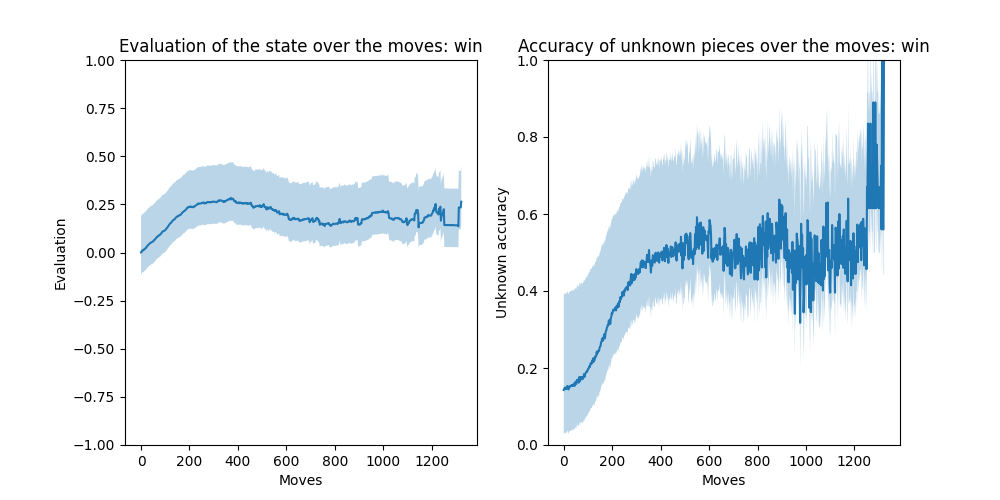
### Evaluation of the state over the moves: lose

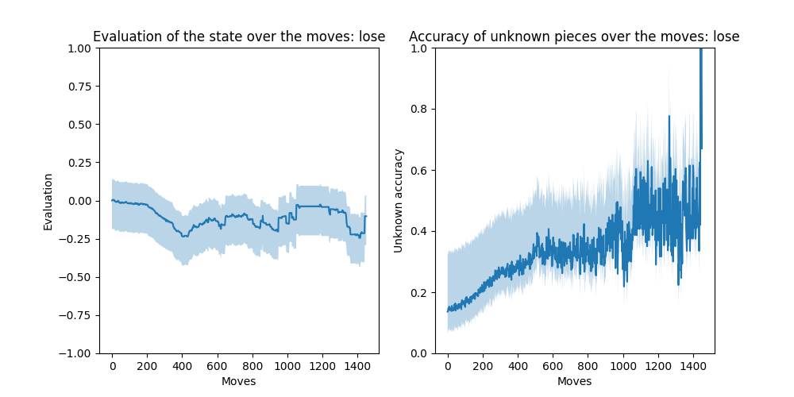
## custom
### Win/Draw/Lose of custom

| ... | custom |
| --- | --- |
| asmodeus | 66/7/27 |
| hunter | 55/7/38 |
| rnad | 96/0/4 |
| mcts | 82/3/15 |
| doi | 20/0/80 |
### Other miscellanous stats

| custom | Nbr Games | Avg_time | Avg_moves |
| --- | --- | --- | --- |
| asmodeus | 100 | 230 | 455 |
| hunter | 100 | 410 | 701 |
| rnad | 100 | 244 | 394 |
| mcts | 100 | 616 | 432 |
| doi | 20 | 0 | 581 |
## asmodeus
### Evaluation of the state over the moves: win

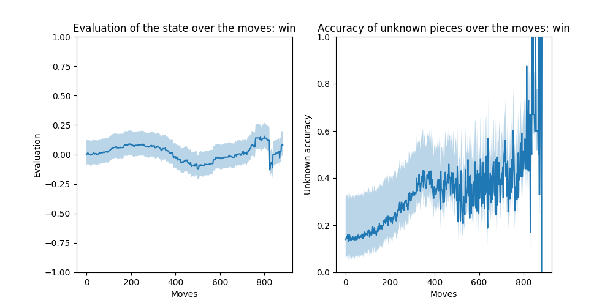
### Evaluation of the state over the moves: lose

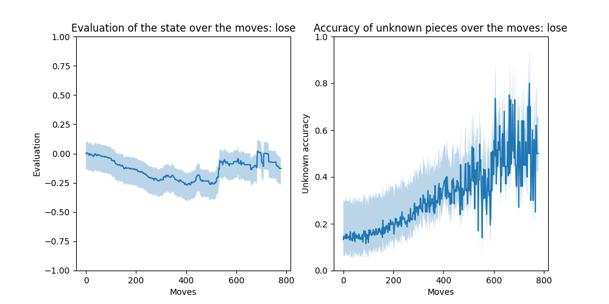
### Win/Draw/Lose of asmodeus

| ... | asmodeus |
| --- | --- |
| custom | 27/7/66 |
| hunter | 42/22/37 |
| rnad | 99/0/1 |
| mcts | 38/6/56 |
### Other miscellanous stats

| asmodeus | Nbr Games | Avg_time | Avg_moves |
| --- | --- | --- | --- |
| custom | 100 | 230 | 455 |
| hunter | 100 | 17 | 576 |
| rnad | 100 | 5 | 340 |
| mcts | 100 | 362 | 403 |
## hunter
### Evaluation of the state over the moves: win

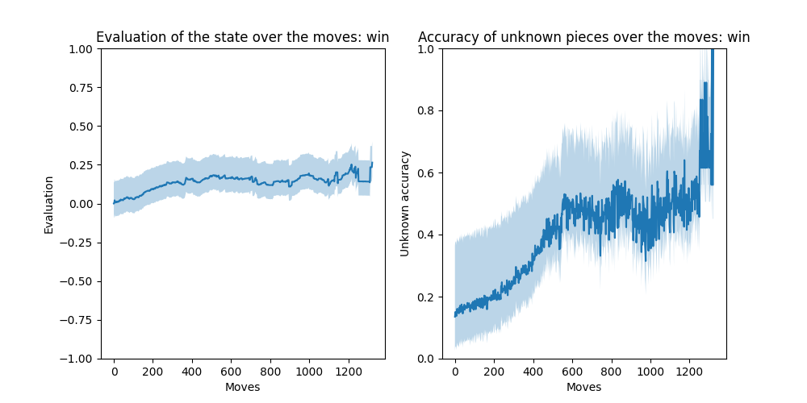
### Evaluation of the state over the moves: lose

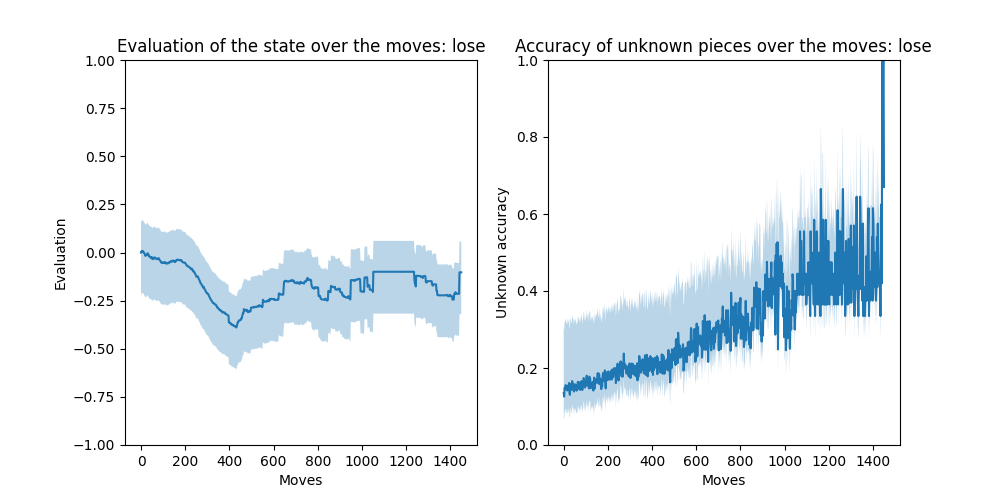
### Win/Draw/Lose of hunter

| ... | hunter |
| --- | --- |
| custom | 38/7/55 |
| asmodeus | 37/22/42 |
| rnad | 97/0/3 |
| mcts | 64/9/27 |
| doi | 0/40/60 |
### Other miscellanous stats

| hunter | Nbr Games | Avg_time | Avg_moves |
| --- | --- | --- | --- |
| custom | 100 | 410 | 701 |
| asmodeus | 100 | 17 | 576 |
| rnad | 100 | 6 | 378 |
| mcts | 100 | 406 | 426 |
| doi | 20 | 0 | 975 |
## rnad
### Evaluation of the state over the moves: win

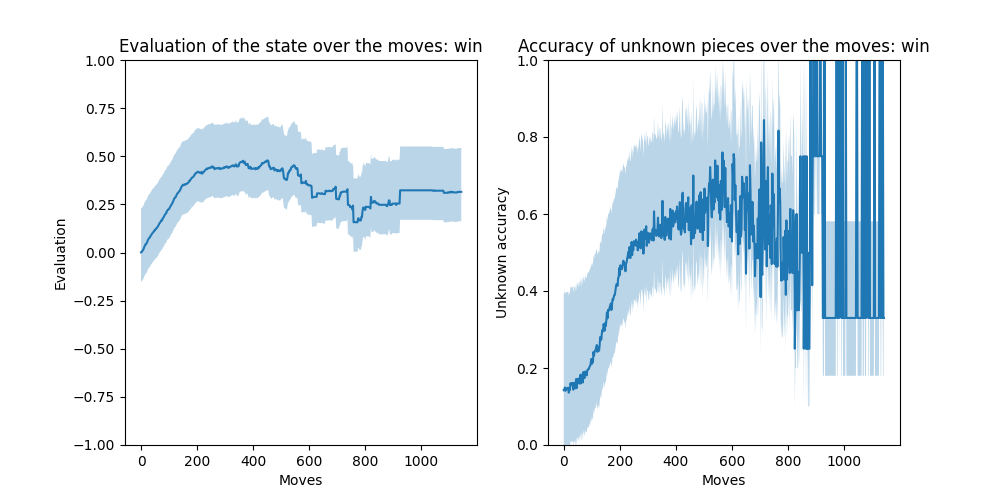
### Evaluation of the state over the moves: lose

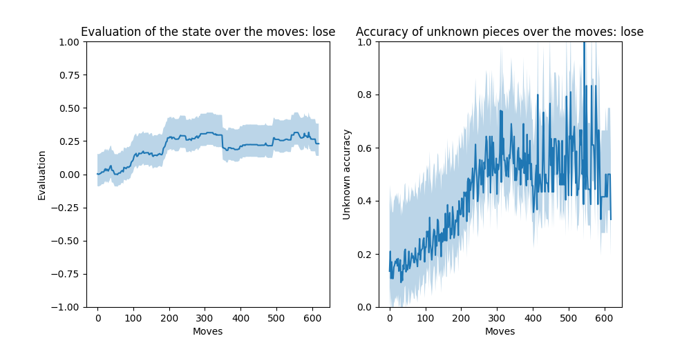
### Win/Draw/Lose of rnad

| ... | rnad |
| --- | --- |
| custom | 4/0/96 |
| asmodeus | 1/0/99 |
| hunter | 3/0/97 |
| mcts | 0/0/100 |
### Other miscellanous stats

| rnad | Nbr Games | Avg_time | Avg_moves |
| --- | --- | --- | --- |
| custom | 100 | 244 | 394 |
| asmodeus | 100 | 5 | 340 |
| hunter | 100 | 6 | 378 |
| mcts | 100 | 434 | 426 |
## mcts
### Evaluation of the state over the moves: win

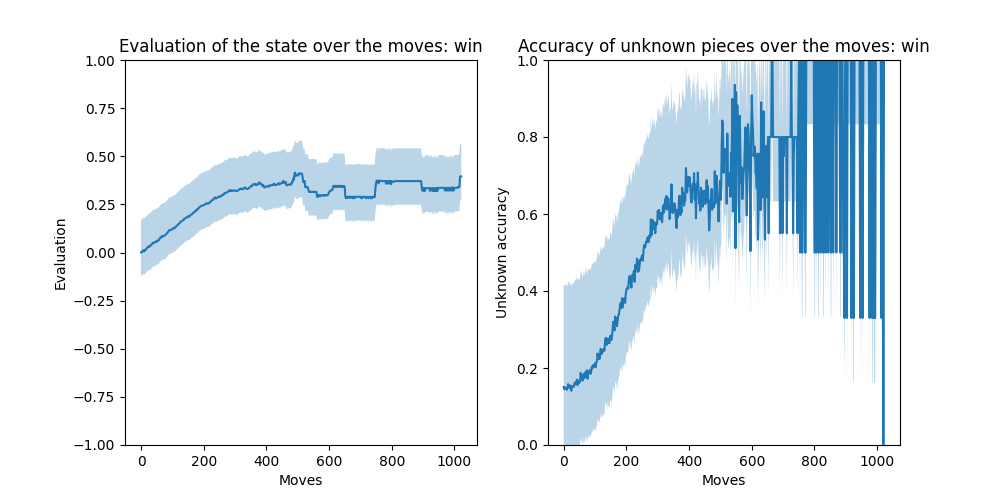
### Evaluation of the state over the moves: lose

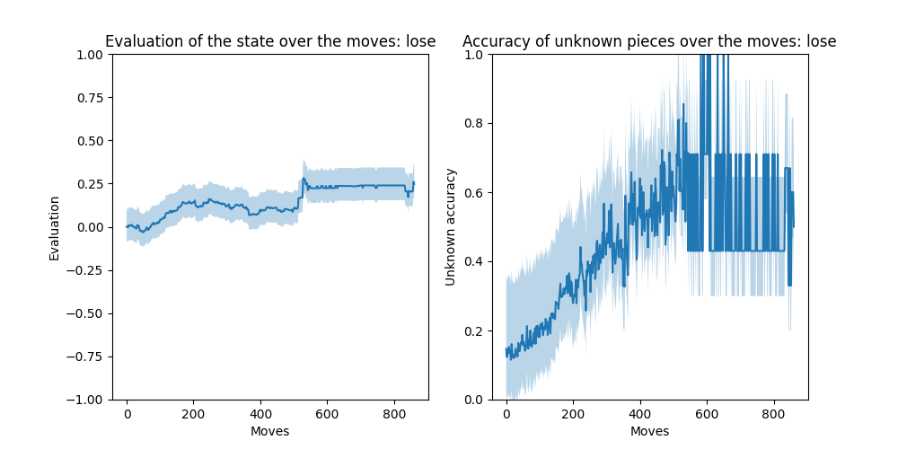
### Win/Draw/Lose of mcts

| ... | mcts |
| --- | --- |
| custom | 15/3/82 |
| asmodeus | 56/6/38 |
| hunter | 27/9/64 |
| rnad | 100/0/0 |
### Other miscellanous stats

| mcts | Nbr Games | Avg_time | Avg_moves |
| --- | --- | --- | --- |
| custom | 100 | 616 | 432 |
| asmodeus | 100 | 362 | 403 |
| hunter | 100 | 406 | 426 |
| rnad | 100 | 434 | 426 |
## doi
### Evaluation of the state over the moves: win

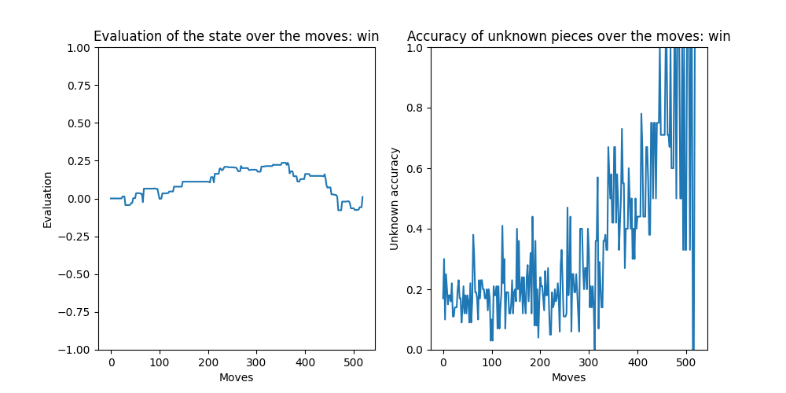
### Evaluation of the state over the moves: lose

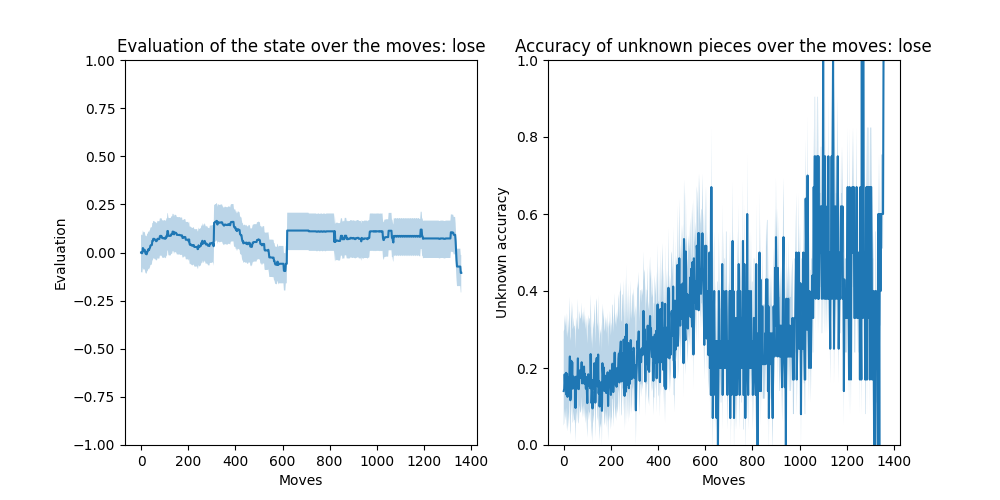
### Win/Draw/Lose of doi

| ... | doi |
| --- | --- |
| custom | 80/0/20 |
| hunter | 60/40/0 |
### Other miscellanous stats

| doi | Nbr Games | Avg_time | Avg_moves |
| --- | --- | --- | --- |
| custom | 20 | 0 | 581 |
| hunter | 20 | 0 | 975 |
## Stats per game

| Game | Nbr_moves | Win | pieces_1 | pieces_2 |
| --- | --- | --- | --- | --- |
| custom-asmodeus0 | 325 | 1 | 11 | 8 |
| custom-asmodeus1 | 494 | -1 | 7 | 12 |
| custom-asmodeus2 | 368 | -1 | 6 | 12 |
| custom-asmodeus3 | 121 | 1 | 29 | 22 |
| custom-asmodeus4 | 183 | 1 | 22 | 16 |
| custom-asmodeus5 | 309 | 1 | 13 | 7 |
| custom-asmodeus6 | 407 | 1 | 15 | 8 |
| custom-asmodeus7 | 823 | 1 | 18 | 7 |
| custom-asmodeus8 | 371 | 1 | 15 | 7 |
| custom-asmodeus9 | 357 | 1 | 8 | 7 |
| custom-asmodeus10 | 1500 | 0 | 18 | 21 |
| custom-asmodeus11 | 401 | 1 | 10 | 7 |
| custom-asmodeus12 | 497 | 1 | 10 | 6 |
| custom-asmodeus13 | 103 | 1 | 28 | 27 |
| custom-asmodeus14 | 317 | 1 | 19 | 15 |
| custom-asmodeus15 | 274 | -1 | 10 | 19 |
| custom-asmodeus16 | 469 | 1 | 12 | 7 |
| custom-asmodeus17 | 209 | 1 | 22 | 14 |
| custom-asmodeus18 | 1500 | 0 | 14 | 7 |
| custom-asmodeus19 | 440 | -1 | 4 | 12 |
| custom-asmodeus20 | 389 | 1 | 11 | 7 |
| custom-asmodeus21 | 420 | -1 | 6 | 10 |
| custom-asmodeus22 | 321 | 1 | 17 | 8 |
| custom-asmodeus23 | 286 | -1 | 13 | 14 |
| custom-asmodeus24 | 379 | 1 | 13 | 9 |
| custom-asmodeus25 | 562 | -1 | 6 | 8 |
| custom-asmodeus26 | 273 | 1 | 17 | 7 |
| custom-asmodeus27 | 315 | 1 | 10 | 7 |
| custom-asmodeus28 | 357 | 1 | 16 | 7 |
| custom-asmodeus29 | 389 | 1 | 22 | 7 |
| custom-asmodeus30 | 335 | 1 | 11 | 6 |
| custom-asmodeus31 | 183 | 1 | 25 | 18 |
| custom-asmodeus32 | 345 | 1 | 15 | 6 |
| custom-asmodeus33 | 377 | 1 | 8 | 8 |
| custom-asmodeus34 | 219 | 1 | 17 | 18 |
| custom-asmodeus35 | 272 | -1 | 8 | 20 |
| custom-asmodeus36 | 208 | -1 | 20 | 21 |
| custom-asmodeus37 | 330 | -1 | 13 | 13 |
| custom-asmodeus38 | 320 | -1 | 4 | 11 |
| custom-asmodeus39 | 453 | 1 | 12 | 7 |
| custom-asmodeus40 | 137 | 1 | 28 | 21 |
| custom-asmodeus41 | 471 | 1 | 11 | 7 |
| custom-asmodeus42 | 407 | 1 | 7 | 6 |
| custom-asmodeus43 | 343 | 1 | 13 | 6 |
| custom-asmodeus44 | 356 | -1 | 10 | 9 |
| custom-asmodeus45 | 355 | 1 | 13 | 7 |
| custom-asmodeus46 | 443 | 1 | 8 | 7 |
| custom-asmodeus47 | 272 | -1 | 22 | 19 |
| custom-asmodeus48 | 253 | 1 | 21 | 7 |
| custom-asmodeus49 | 333 | 1 | 20 | 11 |
| custom-hunter0 | 848 | -1 | 8 | 25 |
| custom-hunter1 | 1500 | 0 | 33 | 27 |
| custom-hunter2 | 417 | 1 | 18 | 10 |
| custom-hunter3 | 1237 | 1 | 17 | 9 |
| custom-hunter4 | 347 | 1 | 21 | 13 |
| custom-hunter5 | 1500 | 0 | 22 | 14 |
| custom-hunter6 | 540 | -1 | 7 | 14 |
| custom-hunter7 | 1500 | 0 | 11 | 20 |
| custom-hunter8 | 541 | 1 | 18 | 9 |
| custom-hunter9 | 911 | 1 | 7 | 8 |
| custom-hunter10 | 442 | -1 | 7 | 23 |
| custom-hunter11 | 1500 | 0 | 31 | 33 |
| custom-hunter12 | 284 | -1 | 7 | 25 |
| custom-hunter13 | 655 | 1 | 8 | 4 |
| custom-hunter14 | 498 | -1 | 6 | 21 |
| custom-hunter15 | 466 | -1 | 8 | 27 |
| custom-hunter16 | 721 | 1 | 11 | 13 |
| custom-hunter17 | 1251 | 1 | 22 | 14 |
| custom-hunter18 | 999 | 1 | 18 | 9 |
| custom-hunter19 | 537 | 1 | 22 | 7 |
| custom-hunter20 | 599 | 1 | 13 | 7 |
| custom-hunter21 | 485 | 1 | 11 | 7 |
| custom-hunter22 | 341 | 1 | 18 | 9 |
| custom-hunter23 | 863 | 1 | 10 | 4 |
| custom-hunter24 | 462 | -1 | 7 | 22 |
| custom-hunter25 | 804 | -1 | 8 | 7 |
| custom-hunter26 | 1129 | 1 | 12 | 11 |
| custom-hunter27 | 369 | 1 | 14 | 21 |
| custom-hunter28 | 1323 | 1 | 11 | 7 |
| custom-hunter29 | 365 | 1 | 10 | 20 |
| custom-hunter30 | 515 | 1 | 14 | 6 |
| custom-hunter31 | 253 | 1 | 26 | 21 |
| custom-hunter32 | 1012 | -1 | 8 | 22 |
| custom-hunter33 | 722 | -1 | 7 | 16 |
| custom-hunter34 | 398 | -1 | 22 | 10 |
| custom-hunter35 | 571 | 1 | 13 | 4 |
| custom-hunter36 | 453 | 1 | 15 | 17 |
| custom-hunter37 | 414 | -1 | 7 | 18 |
| custom-hunter38 | 1500 | 0 | 11 | 15 |
| custom-hunter39 | 271 | 1 | 15 | 23 |
| custom-hunter40 | 372 | -1 | 7 | 23 |
| custom-hunter41 | 134 | -1 | 24 | 28 |
| custom-hunter42 | 567 | 1 | 15 | 6 |
| custom-hunter43 | 536 | -1 | 9 | 17 |
| custom-hunter44 | 438 | -1 | 7 | 27 |
| custom-hunter45 | 807 | 1 | 10 | 8 |
| custom-hunter46 | 454 | -1 | 6 | 20 |
| custom-hunter47 | 489 | 1 | 13 | 10 |
| custom-hunter48 | 1052 | -1 | 7 | 20 |
| custom-hunter49 | 475 | 1 | 15 | 7 |
| custom-rnad0 | 257 | 1 | 32 | 7 |
| custom-rnad1 | 411 | 1 | 23 | 8 |
| custom-rnad2 | 489 | 1 | 22 | 7 |
| custom-rnad3 | 121 | 1 | 36 | 13 |
| custom-rnad4 | 435 | 1 | 16 | 5 |
| custom-rnad5 | 349 | 1 | 23 | 20 |
| custom-rnad6 | 620 | -1 | 15 | 10 |
| custom-rnad7 | 297 | 1 | 22 | 6 |
| custom-rnad8 | 610 | -1 | 16 | 7 |
| custom-rnad9 | 165 | 1 | 31 | 7 |
| custom-rnad10 | 217 | 1 | 30 | 7 |
| custom-rnad11 | 821 | 1 | 16 | 7 |
| custom-rnad12 | 275 | 1 | 29 | 7 |
| custom-rnad13 | 243 | 1 | 25 | 16 |
| custom-rnad14 | 279 | 1 | 24 | 7 |
| custom-rnad15 | 453 | 1 | 23 | 3 |
| custom-rnad16 | 309 | 1 | 23 | 7 |
| custom-rnad17 | 309 | 1 | 24 | 8 |
| custom-rnad18 | 217 | 1 | 32 | 7 |
| custom-rnad19 | 559 | 1 | 26 | 7 |
| custom-rnad20 | 93 | 1 | 34 | 22 |
| custom-rnad21 | 419 | 1 | 23 | 7 |
| custom-rnad22 | 373 | 1 | 24 | 3 |
| custom-rnad23 | 293 | 1 | 23 | 7 |
| custom-rnad24 | 397 | 1 | 20 | 5 |
| custom-rnad25 | 151 | 1 | 32 | 11 |
| custom-rnad26 | 109 | 1 | 33 | 22 |
| custom-rnad27 | 391 | 1 | 30 | 6 |
| custom-rnad28 | 589 | 1 | 21 | 7 |
| custom-rnad29 | 173 | 1 | 32 | 7 |
| custom-rnad30 | 590 | -1 | 15 | 8 |
| custom-rnad31 | 737 | 1 | 23 | 6 |
| custom-rnad32 | 209 | 1 | 31 | 7 |
| custom-rnad33 | 537 | 1 | 23 | 8 |
| custom-rnad34 | 307 | 1 | 25 | 8 |
| custom-rnad35 | 497 | 1 | 18 | 7 |
| custom-rnad36 | 383 | 1 | 29 | 6 |
| custom-rnad37 | 341 | 1 | 26 | 7 |
| custom-rnad38 | 211 | 1 | 33 | 7 |
| custom-rnad39 | 507 | 1 | 24 | 3 |
| custom-rnad40 | 493 | 1 | 21 | 5 |
| custom-rnad41 | 145 | 1 | 31 | 17 |
| custom-rnad42 | 381 | 1 | 27 | 8 |
| custom-rnad43 | 445 | 1 | 21 | 7 |
| custom-rnad44 | 757 | 1 | 22 | 7 |
| custom-rnad45 | 265 | 1 | 25 | 8 |
| custom-rnad46 | 457 | 1 | 25 | 6 |
| custom-rnad47 | 571 | 1 | 27 | 7 |
| custom-rnad48 | 341 | 1 | 24 | 7 |
| custom-rnad49 | 331 | 1 | 25 | 4 |
| custom-mcts0 | 528 | -1 | 7 | 9 |
| custom-mcts1 | 407 | 1 | 14 | 4 |
| custom-mcts2 | 104 | -1 | 21 | 21 |
| custom-mcts3 | 399 | 1 | 13 | 7 |
| custom-mcts4 | 357 | 1 | 10 | 6 |
| custom-mcts5 | 393 | 1 | 14 | 7 |
| custom-mcts6 | 517 | 1 | 24 | 7 |
| custom-mcts7 | 489 | 1 | 10 | 12 |
| custom-mcts8 | 241 | 1 | 22 | 9 |
| custom-mcts9 | 164 | -1 | 25 | 19 |
| custom-mcts10 | 383 | 1 | 16 | 7 |
| custom-mcts11 | 605 | 1 | 12 | 3 |
| custom-mcts12 | 377 | 1 | 17 | 8 |
| custom-mcts13 | 355 | 1 | 16 | 10 |
| custom-mcts14 | 409 | 1 | 14 | 8 |
| custom-mcts15 | 455 | 1 | 16 | 4 |
| custom-mcts16 | 333 | 1 | 22 | 7 |
| custom-mcts17 | 443 | 1 | 14 | 7 |
| custom-mcts18 | 299 | 1 | 22 | 6 |
| custom-mcts19 | 367 | 1 | 18 | 3 |
| custom-mcts20 | 391 | 1 | 22 | 9 |
| custom-mcts21 | 523 | 1 | 19 | 4 |
| custom-mcts22 | 357 | 1 | 13 | 7 |
| custom-mcts23 | 335 | 1 | 12 | 7 |
| custom-mcts24 | 379 | 1 | 24 | 7 |
| custom-mcts25 | 351 | 1 | 14 | 6 |
| custom-mcts26 | 138 | -1 | 24 | 26 |
| custom-mcts27 | 367 | 1 | 18 | 6 |
| custom-mcts28 | 1500 | 0 | 8 | 3 |
| custom-mcts29 | 613 | 1 | 12 | 5 |
| custom-mcts30 | 423 | 1 | 10 | 6 |
| custom-mcts31 | 337 | 1 | 20 | 7 |
| custom-mcts32 | 1023 | 1 | 13 | 4 |
| custom-mcts33 | 321 | 1 | 18 | 10 |
| custom-mcts34 | 321 | 1 | 19 | 7 |
| custom-mcts35 | 335 | 1 | 19 | 4 |
| custom-mcts36 | 346 | -1 | 19 | 13 |
| custom-mcts37 | 481 | 1 | 12 | 11 |
| custom-mcts38 | 308 | -1 | 15 | 10 |
| custom-mcts39 | 605 | 1 | 14 | 4 |
| custom-mcts40 | 544 | -1 | 8 | 6 |
| custom-mcts41 | 515 | 1 | 21 | 7 |
| custom-mcts42 | 230 | -1 | 15 | 17 |
| custom-mcts43 | 327 | 1 | 17 | 10 |
| custom-mcts44 | 385 | 1 | 14 | 3 |
| custom-mcts45 | 353 | 1 | 22 | 7 |
| custom-mcts46 | 285 | 1 | 17 | 5 |
| custom-mcts47 | 514 | -1 | 6 | 10 |
| custom-mcts48 | 237 | 1 | 19 | 12 |
| custom-mcts49 | 453 | 1 | 16 | 9 |
| asmodeus-custom0 | 273 | 1 | 14 | 13 |
| asmodeus-custom1 | 1500 | 0 | 10 | 4 |
| asmodeus-custom2 | 409 | 1 | 12 | 5 |
| asmodeus-custom3 | 138 | -1 | 17 | 28 |
| asmodeus-custom4 | 330 | -1 | 9 | 15 |
| asmodeus-custom5 | 370 | -1 | 6 | 11 |
| asmodeus-custom6 | 476 | -1 | 8 | 7 |
| asmodeus-custom7 | 356 | -1 | 5 | 15 |
| asmodeus-custom8 | 410 | -1 | 6 | 8 |
| asmodeus-custom9 | 457 | 1 | 7 | 6 |
| asmodeus-custom10 | 401 | 1 | 7 | 5 |
| asmodeus-custom11 | 386 | -1 | 6 | 15 |
| asmodeus-custom12 | 784 | -1 | 10 | 15 |
| asmodeus-custom13 | 523 | 1 | 10 | 3 |
| asmodeus-custom14 | 260 | -1 | 10 | 14 |
| asmodeus-custom15 | 570 | -1 | 7 | 4 |
| asmodeus-custom16 | 1500 | 0 | 10 | 3 |
| asmodeus-custom17 | 338 | -1 | 9 | 16 |
| asmodeus-custom18 | 260 | -1 | 7 | 17 |
| asmodeus-custom19 | 142 | -1 | 25 | 22 |
| asmodeus-custom20 | 424 | -1 | 7 | 18 |
| asmodeus-custom21 | 535 | 1 | 8 | 3 |
| asmodeus-custom22 | 308 | -1 | 7 | 20 |
| asmodeus-custom23 | 362 | -1 | 9 | 13 |
| asmodeus-custom24 | 311 | 1 | 19 | 11 |
| asmodeus-custom25 | 382 | -1 | 7 | 9 |
| asmodeus-custom26 | 1500 | 0 | 9 | 4 |
| asmodeus-custom27 | 154 | -1 | 20 | 25 |
| asmodeus-custom28 | 421 | 1 | 11 | 4 |
| asmodeus-custom29 | 308 | -1 | 5 | 15 |
| asmodeus-custom30 | 706 | -1 | 6 | 8 |
| asmodeus-custom31 | 419 | 1 | 13 | 3 |
| asmodeus-custom32 | 160 | -1 | 22 | 27 |
| asmodeus-custom33 | 308 | -1 | 18 | 16 |
| asmodeus-custom34 | 685 | 1 | 8 | 4 |
| asmodeus-custom35 | 1500 | 0 | 8 | 8 |
| asmodeus-custom36 | 294 | -1 | 8 | 20 |
| asmodeus-custom37 | 506 | -1 | 10 | 5 |
| asmodeus-custom38 | 403 | 1 | 13 | 4 |
| asmodeus-custom39 | 294 | -1 | 6 | 10 |
| asmodeus-custom40 | 1500 | 0 | 12 | 16 |
| asmodeus-custom41 | 781 | 1 | 10 | 6 |
| asmodeus-custom42 | 884 | -1 | 5 | 10 |
| asmodeus-custom43 | 264 | -1 | 7 | 15 |
| asmodeus-custom44 | 506 | -1 | 6 | 6 |
| asmodeus-custom45 | 531 | 1 | 15 | 4 |
| asmodeus-custom46 | 423 | 1 | 10 | 5 |
| asmodeus-custom47 | 168 | -1 | 20 | 20 |
| asmodeus-custom48 | 760 | -1 | 5 | 7 |
| asmodeus-custom49 | 306 | -1 | 8 | 11 |
| hunter-custom0 | 376 | -1 | 14 | 15 |
| hunter-custom1 | 498 | -1 | 7 | 16 |
| hunter-custom2 | 625 | 1 | 26 | 7 |
| hunter-custom3 | 710 | -1 | 1 | 16 |
| hunter-custom4 | 1443 | 1 | 15 | 7 |
| hunter-custom5 | 461 | 1 | 20 | 7 |
| hunter-custom6 | 694 | -1 | 7 | 17 |
| hunter-custom7 | 1500 | 0 | 15 | 13 |
| hunter-custom8 | 459 | 1 | 25 | 9 |
| hunter-custom9 | 413 | 1 | 21 | 8 |
| hunter-custom10 | 330 | -1 | 7 | 20 |
| hunter-custom11 | 861 | 1 | 18 | 7 |
| hunter-custom12 | 995 | 1 | 6 | 6 |
| hunter-custom13 | 773 | 1 | 7 | 7 |
| hunter-custom14 | 728 | -1 | 5 | 13 |
| hunter-custom15 | 1146 | -1 | 7 | 16 |
| hunter-custom16 | 406 | -1 | 12 | 27 |
| hunter-custom17 | 374 | -1 | 8 | 15 |
| hunter-custom18 | 553 | 1 | 27 | 7 |
| hunter-custom19 | 570 | -1 | 6 | 17 |
| hunter-custom20 | 583 | 1 | 16 | 5 |
| hunter-custom21 | 333 | 1 | 20 | 7 |
| hunter-custom22 | 649 | 1 | 24 | 6 |
| hunter-custom23 | 524 | -1 | 3 | 12 |
| hunter-custom24 | 368 | -1 | 19 | 15 |
| hunter-custom25 | 734 | -1 | 4 | 15 |
| hunter-custom26 | 364 | -1 | 17 | 11 |
| hunter-custom27 | 152 | -1 | 26 | 20 |
| hunter-custom28 | 1500 | 0 | 15 | 15 |
| hunter-custom29 | 431 | 1 | 14 | 8 |
| hunter-custom30 | 415 | 1 | 14 | 8 |
| hunter-custom31 | 606 | -1 | 8 | 12 |
| hunter-custom32 | 1312 | -1 | 8 | 8 |
| hunter-custom33 | 954 | -1 | 6 | 8 |
| hunter-custom34 | 896 | -1 | 1 | 12 |
| hunter-custom35 | 536 | -1 | 8 | 9 |
| hunter-custom36 | 437 | 1 | 24 | 7 |
| hunter-custom37 | 1062 | -1 | 6 | 9 |
| hunter-custom38 | 634 | -1 | 5 | 16 |
| hunter-custom39 | 516 | -1 | 7 | 9 |
| hunter-custom40 | 647 | 1 | 26 | 7 |
| hunter-custom41 | 624 | -1 | 8 | 9 |
| hunter-custom42 | 700 | -1 | 15 | 10 |
| hunter-custom43 | 951 | 1 | 27 | 7 |
| hunter-custom44 | 1453 | 1 | 9 | 7 |
| hunter-custom45 | 1098 | -1 | 6 | 16 |
| hunter-custom46 | 818 | -1 | 18 | 14 |
| hunter-custom47 | 530 | -1 | 9 | 15 |
| hunter-custom48 | 495 | 1 | 20 | 5 |
| hunter-custom49 | 1027 | 1 | 11 | 8 |
| rnad-custom0 | 366 | -1 | 6 | 22 |
| rnad-custom1 | 366 | -1 | 7 | 21 |
| rnad-custom2 | 160 | -1 | 6 | 29 |
| rnad-custom3 | 398 | -1 | 10 | 28 |
| rnad-custom4 | 442 | -1 | 6 | 20 |
| rnad-custom5 | 348 | -1 | 5 | 22 |
| rnad-custom6 | 610 | -1 | 6 | 27 |
| rnad-custom7 | 348 | -1 | 8 | 26 |
| rnad-custom8 | 366 | -1 | 4 | 24 |
| rnad-custom9 | 206 | -1 | 7 | 29 |
| rnad-custom10 | 372 | -1 | 7 | 34 |
| rnad-custom11 | 420 | -1 | 6 | 17 |
| rnad-custom12 | 436 | -1 | 3 | 23 |
| rnad-custom13 | 248 | -1 | 9 | 29 |
| rnad-custom14 | 456 | -1 | 3 | 19 |
| rnad-custom15 | 696 | -1 | 5 | 24 |
| rnad-custom16 | 414 | -1 | 7 | 21 |
| rnad-custom17 | 256 | -1 | 6 | 27 |
| rnad-custom18 | 266 | -1 | 7 | 27 |
| rnad-custom19 | 434 | -1 | 7 | 26 |
| rnad-custom20 | 1144 | -1 | 7 | 19 |
| rnad-custom21 | 268 | -1 | 13 | 33 |
| rnad-custom22 | 338 | -1 | 12 | 22 |
| rnad-custom23 | 340 | -1 | 7 | 25 |
| rnad-custom24 | 342 | -1 | 7 | 23 |
| rnad-custom25 | 262 | -1 | 7 | 29 |
| rnad-custom26 | 244 | -1 | 7 | 25 |
| rnad-custom27 | 582 | -1 | 7 | 20 |
| rnad-custom28 | 362 | -1 | 8 | 25 |
| rnad-custom29 | 230 | -1 | 8 | 23 |
| rnad-custom30 | 310 | -1 | 9 | 30 |
| rnad-custom31 | 510 | -1 | 3 | 23 |
| rnad-custom32 | 444 | -1 | 6 | 21 |
| rnad-custom33 | 304 | -1 | 6 | 22 |
| rnad-custom34 | 408 | -1 | 7 | 27 |
| rnad-custom35 | 544 | -1 | 1 | 14 |
| rnad-custom36 | 382 | -1 | 8 | 29 |
| rnad-custom37 | 462 | -1 | 5 | 25 |
| rnad-custom38 | 456 | -1 | 4 | 24 |
| rnad-custom39 | 924 | -1 | 6 | 10 |
| rnad-custom40 | 384 | -1 | 8 | 24 |
| rnad-custom41 | 506 | -1 | 7 | 25 |
| rnad-custom42 | 282 | -1 | 7 | 27 |
| rnad-custom43 | 204 | -1 | 9 | 28 |
| rnad-custom44 | 476 | -1 | 7 | 29 |
| rnad-custom45 | 524 | -1 | 11 | 19 |
| rnad-custom46 | 262 | -1 | 7 | 29 |
| rnad-custom47 | 548 | -1 | 5 | 19 |
| rnad-custom48 | 351 | 1 | 8 | 23 |
| rnad-custom49 | 486 | -1 | 3 | 19 |
| mcts-custom0 | 562 | -1 | 8 | 18 |
| mcts-custom1 | 384 | -1 | 3 | 13 |
| mcts-custom2 | 1500 | 0 | 10 | 20 |
| mcts-custom3 | 306 | -1 | 7 | 15 |
| mcts-custom4 | 652 | -1 | 6 | 17 |
| mcts-custom5 | 606 | -1 | 7 | 14 |
| mcts-custom6 | 247 | 1 | 16 | 13 |
| mcts-custom7 | 440 | -1 | 7 | 15 |
| mcts-custom8 | 174 | -1 | 13 | 21 |
| mcts-custom9 | 386 | -1 | 6 | 22 |
| mcts-custom10 | 364 | -1 | 6 | 19 |
| mcts-custom11 | 536 | -1 | 5 | 15 |
| mcts-custom12 | 1500 | 0 | 8 | 20 |
| mcts-custom13 | 488 | -1 | 7 | 17 |
| mcts-custom14 | 494 | -1 | 5 | 21 |
| mcts-custom15 | 234 | -1 | 12 | 20 |
| mcts-custom16 | 750 | -1 | 7 | 15 |
| mcts-custom17 | 322 | -1 | 5 | 17 |
| mcts-custom18 | 863 | 1 | 5 | 7 |
| mcts-custom19 | 156 | -1 | 13 | 25 |
| mcts-custom20 | 304 | -1 | 7 | 16 |
| mcts-custom21 | 486 | -1 | 6 | 14 |
| mcts-custom22 | 317 | 1 | 10 | 10 |
| mcts-custom23 | 428 | -1 | 3 | 14 |
| mcts-custom24 | 512 | -1 | 3 | 14 |
| mcts-custom25 | 286 | -1 | 7 | 16 |
| mcts-custom26 | 367 | 1 | 8 | 15 |
| mcts-custom27 | 358 | -1 | 9 | 18 |
| mcts-custom28 | 442 | -1 | 6 | 18 |
| mcts-custom29 | 382 | -1 | 7 | 17 |
| mcts-custom30 | 390 | -1 | 6 | 12 |
| mcts-custom31 | 288 | -1 | 10 | 12 |
| mcts-custom32 | 444 | -1 | 6 | 16 |
| mcts-custom33 | 484 | -1 | 7 | 19 |
| mcts-custom34 | 357 | 1 | 13 | 14 |
| mcts-custom35 | 606 | -1 | 7 | 11 |
| mcts-custom36 | 302 | -1 | 8 | 16 |
| mcts-custom37 | 376 | -1 | 6 | 9 |
| mcts-custom38 | 206 | -1 | 10 | 18 |
| mcts-custom39 | 388 | -1 | 6 | 18 |
| mcts-custom40 | 488 | -1 | 3 | 19 |
| mcts-custom41 | 486 | -1 | 8 | 13 |
| mcts-custom42 | 305 | 1 | 10 | 14 |
| mcts-custom43 | 336 | -1 | 7 | 17 |
| mcts-custom44 | 344 | -1 | 9 | 20 |
| mcts-custom45 | 302 | -1 | 7 | 20 |
| mcts-custom46 | 394 | -1 | 5 | 20 |
| mcts-custom47 | 464 | -1 | 6 | 24 |
| mcts-custom48 | 238 | -1 | 4 | 25 |
| mcts-custom49 | 302 | -1 | 7 | 17 |
| doi-custom0 | 473 | 1 | 15 | 8 |
| doi-custom1 | 607 | 1 | 8 | 16 |
| doi-custom2 | 621 | 1 | 14 | 8 |
| doi-custom3 | 1361 | 1 | 10 | 10 |
| doi-custom4 | 520 | -1 | 6 | 8 |
| doi-custom5 | 311 | 1 | 16 | 9 |
| doi-custom6 | 311 | 1 | 16 | 9 |
| doi-custom7 | 473 | 1 | 15 | 8 |
| doi-custom8 | 520 | -1 | 6 | 8 |
| doi-custom9 | 621 | 1 | 14 | 8 |
| asmodeus-hunter0 | 298 | -1 | 7 | 27 |
| asmodeus-hunter1 | 422 | -1 | 7 | 13 |
| asmodeus-hunter2 | 360 | -1 | 7 | 15 |
| asmodeus-hunter3 | 1500 | 0 | 28 | 30 |
| asmodeus-hunter4 | 1500 | 0 | 10 | 21 |
| asmodeus-hunter5 | 577 | 1 | 10 | 5 |
| asmodeus-hunter6 | 180 | -1 | 15 | 30 |
| asmodeus-hunter7 | 258 | -1 | 9 | 24 |
| asmodeus-hunter8 | 577 | 1 | 10 | 5 |
| asmodeus-hunter9 | 1500 | 0 | 21 | 28 |
| asmodeus-hunter10 | 354 | -1 | 7 | 21 |
| asmodeus-hunter11 | 453 | 1 | 11 | 7 |
| asmodeus-hunter12 | 1500 | 0 | 28 | 30 |
| asmodeus-hunter13 | 372 | -1 | 7 | 21 |
| asmodeus-hunter14 | 491 | 1 | 11 | 3 |
| asmodeus-hunter15 | 360 | -1 | 7 | 15 |
| asmodeus-hunter16 | 342 | -1 | 6 | 16 |
| asmodeus-hunter17 | 324 | -1 | 7 | 15 |
| asmodeus-hunter18 | 300 | -1 | 8 | 25 |
| asmodeus-hunter19 | 551 | 1 | 7 | 5 |
| asmodeus-hunter20 | 1500 | 0 | 27 | 25 |
| asmodeus-hunter21 | 298 | -1 | 7 | 27 |
| asmodeus-hunter22 | 356 | -1 | 5 | 20 |
| asmodeus-hunter23 | 1500 | 0 | 14 | 29 |
| asmodeus-hunter24 | 1500 | 0 | 27 | 25 |
| asmodeus-hunter25 | 217 | 1 | 12 | 21 |
| asmodeus-hunter26 | 1500 | 0 | 10 | 8 |
| asmodeus-hunter27 | 358 | -1 | 7 | 19 |
| asmodeus-hunter28 | 1500 | 0 | 19 | 20 |
| asmodeus-hunter29 | 1500 | 0 | 7 | 10 |
| asmodeus-hunter30 | 533 | 1 | 8 | 4 |
| asmodeus-hunter31 | 261 | 1 | 20 | 20 |
| asmodeus-hunter32 | 356 | -1 | 5 | 20 |
| asmodeus-hunter33 | 1500 | 0 | 10 | 21 |
| asmodeus-hunter34 | 356 | -1 | 5 | 20 |
| asmodeus-hunter35 | 551 | 1 | 7 | 5 |
| asmodeus-hunter36 | 1500 | 0 | 7 | 10 |
| asmodeus-hunter37 | 324 | -1 | 7 | 15 |
| asmodeus-hunter38 | 365 | 1 | 14 | 11 |
| asmodeus-hunter39 | 372 | -1 | 7 | 21 |
| asmodeus-hunter40 | 1500 | 0 | 17 | 21 |
| asmodeus-hunter41 | 142 | -1 | 21 | 27 |
| asmodeus-hunter42 | 276 | -1 | 8 | 24 |
| asmodeus-hunter43 | 402 | -1 | 8 | 15 |
| asmodeus-hunter44 | 270 | -1 | 7 | 27 |
| asmodeus-hunter45 | 333 | 1 | 9 | 17 |
| asmodeus-hunter46 | 339 | 1 | 16 | 12 |
| asmodeus-hunter47 | 551 | 1 | 7 | 5 |
| asmodeus-hunter48 | 372 | -1 | 7 | 21 |
| asmodeus-hunter49 | 248 | -1 | 8 | 23 |
| asmodeus-rnad0 | 203 | 1 | 26 | 10 |
| asmodeus-rnad1 | 389 | 1 | 15 | 5 |
| asmodeus-rnad2 | 377 | 1 | 13 | 2 |
| asmodeus-rnad3 | 317 | 1 | 19 | 4 |
| asmodeus-rnad4 | 583 | 1 | 12 | 3 |
| asmodeus-rnad5 | 359 | 1 | 18 | 2 |
| asmodeus-rnad6 | 369 | 1 | 21 | 6 |
| asmodeus-rnad7 | 327 | 1 | 21 | 4 |
| asmodeus-rnad8 | 369 | 1 | 16 | 3 |
| asmodeus-rnad9 | 331 | 1 | 17 | 5 |
| asmodeus-rnad10 | 239 | 1 | 21 | 11 |
| asmodeus-rnad11 | 233 | 1 | 25 | 6 |
| asmodeus-rnad12 | 357 | 1 | 15 | 3 |
| asmodeus-rnad13 | 309 | 1 | 22 | 5 |
| asmodeus-rnad14 | 337 | 1 | 20 | 5 |
| asmodeus-rnad15 | 443 | 1 | 13 | 3 |
| asmodeus-rnad16 | 299 | 1 | 18 | 6 |
| asmodeus-rnad17 | 389 | 1 | 18 | 3 |
| asmodeus-rnad18 | 349 | 1 | 22 | 4 |
| asmodeus-rnad19 | 315 | 1 | 21 | 5 |
| asmodeus-rnad20 | 319 | 1 | 22 | 4 |
| asmodeus-rnad21 | 349 | 1 | 18 | 4 |
| asmodeus-rnad22 | 429 | 1 | 15 | 3 |
| asmodeus-rnad23 | 437 | 1 | 16 | 4 |
| asmodeus-rnad24 | 405 | 1 | 17 | 2 |
| asmodeus-rnad25 | 365 | 1 | 18 | 2 |
| asmodeus-rnad26 | 181 | 1 | 27 | 9 |
| asmodeus-rnad27 | 361 | 1 | 16 | 3 |
| asmodeus-rnad28 | 353 | 1 | 21 | 4 |
| asmodeus-rnad29 | 329 | 1 | 19 | 4 |
| asmodeus-rnad30 | 313 | 1 | 19 | 3 |
| asmodeus-rnad31 | 311 | 1 | 18 | 5 |
| asmodeus-rnad32 | 369 | 1 | 19 | 4 |
| asmodeus-rnad33 | 619 | 1 | 12 | 2 |
| asmodeus-rnad34 | 369 | 1 | 19 | 6 |
| asmodeus-rnad35 | 419 | 1 | 11 | 2 |
| asmodeus-rnad36 | 505 | 1 | 19 | 3 |
| asmodeus-rnad37 | 379 | 1 | 16 | 4 |
| asmodeus-rnad38 | 339 | 1 | 18 | 3 |
| asmodeus-rnad39 | 329 | 1 | 22 | 6 |
| asmodeus-rnad40 | 184 | -1 | 24 | 15 |
| asmodeus-rnad41 | 301 | 1 | 21 | 5 |
| asmodeus-rnad42 | 371 | 1 | 17 | 3 |
| asmodeus-rnad43 | 451 | 1 | 20 | 1 |
| asmodeus-rnad44 | 321 | 1 | 21 | 4 |
| asmodeus-rnad45 | 351 | 1 | 16 | 4 |
| asmodeus-rnad46 | 337 | 1 | 16 | 4 |
| asmodeus-rnad47 | 173 | 1 | 28 | 14 |
| asmodeus-rnad48 | 401 | 1 | 13 | 2 |
| asmodeus-rnad49 | 309 | 1 | 20 | 4 |
| asmodeus-mcts0 | 532 | -1 | 6 | 6 |
| asmodeus-mcts1 | 439 | 1 | 10 | 6 |
| asmodeus-mcts2 | 445 | 1 | 11 | 6 |
| asmodeus-mcts3 | 328 | -1 | 11 | 9 |
| asmodeus-mcts4 | 706 | -1 | 6 | 7 |
| asmodeus-mcts5 | 459 | 1 | 8 | 7 |
| asmodeus-mcts6 | 475 | 1 | 12 | 4 |
| asmodeus-mcts7 | 458 | -1 | 3 | 9 |
| asmodeus-mcts8 | 299 | 1 | 16 | 5 |
| asmodeus-mcts9 | 539 | 1 | 10 | 5 |
| asmodeus-mcts10 | 179 | 1 | 18 | 17 |
| asmodeus-mcts11 | 207 | 1 | 18 | 12 |
| asmodeus-mcts12 | 444 | -1 | 9 | 5 |
| asmodeus-mcts13 | 434 | -1 | 7 | 6 |
| asmodeus-mcts14 | 233 | 1 | 17 | 13 |
| asmodeus-mcts15 | 396 | -1 | 7 | 9 |
| asmodeus-mcts16 | 392 | -1 | 6 | 9 |
| asmodeus-mcts17 | 400 | -1 | 7 | 12 |
| asmodeus-mcts18 | 287 | 1 | 15 | 7 |
| asmodeus-mcts19 | 368 | -1 | 6 | 10 |
| asmodeus-mcts20 | 369 | 1 | 11 | 9 |
| asmodeus-mcts21 | 436 | -1 | 6 | 7 |
| asmodeus-mcts22 | 367 | 1 | 9 | 5 |
| asmodeus-mcts23 | 458 | -1 | 7 | 5 |
| asmodeus-mcts24 | 480 | -1 | 4 | 8 |
| asmodeus-mcts25 | 505 | 1 | 7 | 6 |
| asmodeus-mcts26 | 388 | -1 | 6 | 5 |
| asmodeus-mcts27 | 369 | 1 | 13 | 4 |
| asmodeus-mcts28 | 372 | -1 | 7 | 11 |
| asmodeus-mcts29 | 1114 | -1 | 4 | 8 |
| asmodeus-mcts30 | 267 | 1 | 15 | 8 |
| asmodeus-mcts31 | 347 | 1 | 13 | 6 |
| asmodeus-mcts32 | 476 | -1 | 7 | 6 |
| asmodeus-mcts33 | 1500 | 0 | 9 | 5 |
| asmodeus-mcts34 | 445 | 1 | 8 | 1 |
| asmodeus-mcts35 | 1500 | 0 | 15 | 8 |
| asmodeus-mcts36 | 346 | -1 | 7 | 6 |
| asmodeus-mcts37 | 256 | -1 | 7 | 11 |
| asmodeus-mcts38 | 112 | -1 | 24 | 25 |
| asmodeus-mcts39 | 232 | -1 | 9 | 18 |
| asmodeus-mcts40 | 264 | -1 | 13 | 18 |
| asmodeus-mcts41 | 451 | 1 | 9 | 2 |
| asmodeus-mcts42 | 342 | -1 | 7 | 16 |
| asmodeus-mcts43 | 1500 | 0 | 11 | 5 |
| asmodeus-mcts44 | 246 | -1 | 7 | 14 |
| asmodeus-mcts45 | 368 | -1 | 6 | 7 |
| asmodeus-mcts46 | 310 | -1 | 13 | 13 |
| asmodeus-mcts47 | 302 | -1 | 7 | 12 |
| asmodeus-mcts48 | 248 | -1 | 7 | 15 |
| asmodeus-mcts49 | 342 | -1 | 12 | 12 |
| hunter-asmodeus0 | 1500 | 0 | 23 | 10 |
| hunter-asmodeus1 | 172 | -1 | 25 | 18 |
| hunter-asmodeus2 | 98 | -1 | 26 | 26 |
| hunter-asmodeus3 | 496 | -1 | 3 | 12 |
| hunter-asmodeus4 | 294 | -1 | 15 | 15 |
| hunter-asmodeus5 | 194 | -1 | 20 | 20 |
| hunter-asmodeus6 | 209 | 1 | 29 | 7 |
| hunter-asmodeus7 | 364 | -1 | 11 | 14 |
| hunter-asmodeus8 | 318 | -1 | 18 | 16 |
| hunter-asmodeus9 | 350 | -1 | 15 | 18 |
| hunter-asmodeus10 | 361 | 1 | 18 | 7 |
| hunter-asmodeus11 | 477 | 1 | 13 | 7 |
| hunter-asmodeus12 | 405 | 1 | 9 | 7 |
| hunter-asmodeus13 | 514 | -1 | 1 | 8 |
| hunter-asmodeus14 | 1500 | 0 | 24 | 24 |
| hunter-asmodeus15 | 130 | -1 | 27 | 26 |
| hunter-asmodeus16 | 162 | -1 | 21 | 20 |
| hunter-asmodeus17 | 1500 | 0 | 24 | 24 |
| hunter-asmodeus18 | 1500 | 0 | 13 | 12 |
| hunter-asmodeus19 | 337 | 1 | 19 | 6 |
| hunter-asmodeus20 | 350 | -1 | 15 | 18 |
| hunter-asmodeus21 | 387 | 1 | 15 | 7 |
| hunter-asmodeus22 | 1500 | 0 | 24 | 15 |
| hunter-asmodeus23 | 335 | 1 | 18 | 7 |
| hunter-asmodeus24 | 387 | 1 | 15 | 7 |
| hunter-asmodeus25 | 102 | -1 | 22 | 30 |
| hunter-asmodeus26 | 261 | 1 | 28 | 7 |
| hunter-asmodeus27 | 390 | -1 | 9 | 15 |
| hunter-asmodeus28 | 222 | -1 | 22 | 21 |
| hunter-asmodeus29 | 1500 | 0 | 24 | 15 |
| hunter-asmodeus30 | 116 | -1 | 27 | 26 |
| hunter-asmodeus31 | 362 | -1 | 7 | 14 |
| hunter-asmodeus32 | 476 | -1 | 2 | 13 |
| hunter-asmodeus33 | 490 | -1 | 10 | 10 |
| hunter-asmodeus34 | 328 | -1 | 19 | 8 |
| hunter-asmodeus35 | 212 | -1 | 20 | 23 |
| hunter-asmodeus36 | 500 | -1 | 1 | 11 |
| hunter-asmodeus37 | 102 | -1 | 22 | 30 |
| hunter-asmodeus38 | 172 | -1 | 25 | 18 |
| hunter-asmodeus39 | 343 | 1 | 21 | 8 |
| hunter-asmodeus40 | 387 | 1 | 15 | 7 |
| hunter-asmodeus41 | 1500 | 0 | 21 | 16 |
| hunter-asmodeus42 | 102 | -1 | 22 | 30 |
| hunter-asmodeus43 | 246 | -1 | 18 | 13 |
| hunter-asmodeus44 | 405 | 1 | 14 | 8 |
| hunter-asmodeus45 | 246 | -1 | 18 | 13 |
| hunter-asmodeus46 | 350 | -1 | 15 | 18 |
| hunter-asmodeus47 | 222 | -1 | 22 | 21 |
| hunter-asmodeus48 | 343 | 1 | 17 | 6 |
| hunter-asmodeus49 | 1500 | 0 | 29 | 24 |
| rnad-asmodeus0 | 294 | -1 | 6 | 24 |
| rnad-asmodeus1 | 336 | -1 | 3 | 20 |
| rnad-asmodeus2 | 358 | -1 | 4 | 19 |
| rnad-asmodeus3 | 298 | -1 | 4 | 22 |
| rnad-asmodeus4 | 218 | -1 | 15 | 22 |
| rnad-asmodeus5 | 314 | -1 | 5 | 20 |
| rnad-asmodeus6 | 358 | -1 | 6 | 16 |
| rnad-asmodeus7 | 392 | -1 | 2 | 15 |
| rnad-asmodeus8 | 154 | -1 | 15 | 29 |
| rnad-asmodeus9 | 364 | -1 | 6 | 18 |
| rnad-asmodeus10 | 410 | -1 | 2 | 16 |
| rnad-asmodeus11 | 448 | -1 | 3 | 15 |
| rnad-asmodeus12 | 100 | -1 | 20 | 31 |
| rnad-asmodeus13 | 280 | -1 | 3 | 22 |
| rnad-asmodeus14 | 346 | -1 | 6 | 21 |
| rnad-asmodeus15 | 332 | -1 | 6 | 20 |
| rnad-asmodeus16 | 366 | -1 | 3 | 19 |
| rnad-asmodeus17 | 248 | -1 | 4 | 23 |
| rnad-asmodeus18 | 450 | -1 | 5 | 10 |
| rnad-asmodeus19 | 364 | -1 | 5 | 18 |
| rnad-asmodeus20 | 468 | -1 | 2 | 13 |
| rnad-asmodeus21 | 420 | -1 | 1 | 15 |
| rnad-asmodeus22 | 408 | -1 | 4 | 18 |
| rnad-asmodeus23 | 144 | -1 | 21 | 29 |
| rnad-asmodeus24 | 440 | -1 | 3 | 10 |
| rnad-asmodeus25 | 440 | -1 | 1 | 15 |
| rnad-asmodeus26 | 324 | -1 | 5 | 20 |
| rnad-asmodeus27 | 326 | -1 | 5 | 18 |
| rnad-asmodeus28 | 416 | -1 | 4 | 12 |
| rnad-asmodeus29 | 20 | -1 | 33 | 37 |
| rnad-asmodeus30 | 266 | -1 | 11 | 21 |
| rnad-asmodeus31 | 50 | -1 | 26 | 35 |
| rnad-asmodeus32 | 372 | -1 | 2 | 17 |
| rnad-asmodeus33 | 344 | -1 | 9 | 13 |
| rnad-asmodeus34 | 288 | -1 | 5 | 20 |
| rnad-asmodeus35 | 378 | -1 | 3 | 16 |
| rnad-asmodeus36 | 438 | -1 | 2 | 14 |
| rnad-asmodeus37 | 288 | -1 | 7 | 21 |
| rnad-asmodeus38 | 478 | -1 | 2 | 19 |
| rnad-asmodeus39 | 456 | -1 | 3 | 15 |
| rnad-asmodeus40 | 392 | -1 | 4 | 13 |
| rnad-asmodeus41 | 276 | -1 | 4 | 23 |
| rnad-asmodeus42 | 334 | -1 | 5 | 16 |
| rnad-asmodeus43 | 310 | -1 | 3 | 20 |
| rnad-asmodeus44 | 440 | -1 | 4 | 18 |
| rnad-asmodeus45 | 282 | -1 | 5 | 21 |
| rnad-asmodeus46 | 304 | -1 | 6 | 19 |
| rnad-asmodeus47 | 406 | -1 | 2 | 19 |
| rnad-asmodeus48 | 276 | -1 | 5 | 23 |
| rnad-asmodeus49 | 270 | -1 | 5 | 23 |
| mcts-asmodeus0 | 352 | -1 | 6 | 17 |
| mcts-asmodeus1 | 267 | 1 | 12 | 10 |
| mcts-asmodeus2 | 342 | -1 | 8 | 8 |
| mcts-asmodeus3 | 272 | -1 | 13 | 15 |
| mcts-asmodeus4 | 121 | 1 | 25 | 20 |
| mcts-asmodeus5 | 43 | 1 | 36 | 28 |
| mcts-asmodeus6 | 365 | 1 | 10 | 7 |
| mcts-asmodeus7 | 475 | 1 | 5 | 8 |
| mcts-asmodeus8 | 69 | 1 | 33 | 24 |
| mcts-asmodeus9 | 32 | -1 | 31 | 37 |
| mcts-asmodeus10 | 301 | 1 | 15 | 14 |
| mcts-asmodeus11 | 393 | 1 | 9 | 5 |
| mcts-asmodeus12 | 263 | 1 | 19 | 15 |
| mcts-asmodeus13 | 399 | 1 | 10 | 8 |
| mcts-asmodeus14 | 462 | -1 | 5 | 12 |
| mcts-asmodeus15 | 99 | 1 | 26 | 20 |
| mcts-asmodeus16 | 171 | 1 | 20 | 18 |
| mcts-asmodeus17 | 370 | -1 | 4 | 11 |
| mcts-asmodeus18 | 469 | 1 | 8 | 8 |
| mcts-asmodeus19 | 360 | -1 | 5 | 15 |
| mcts-asmodeus20 | 262 | -1 | 14 | 18 |
| mcts-asmodeus21 | 414 | -1 | 2 | 7 |
| mcts-asmodeus22 | 486 | -1 | 3 | 11 |
| mcts-asmodeus23 | 194 | -1 | 19 | 15 |
| mcts-asmodeus24 | 267 | 1 | 17 | 16 |
| mcts-asmodeus25 | 263 | 1 | 13 | 8 |
| mcts-asmodeus26 | 317 | 1 | 13 | 7 |
| mcts-asmodeus27 | 152 | -1 | 21 | 21 |
| mcts-asmodeus28 | 69 | 1 | 31 | 26 |
| mcts-asmodeus29 | 394 | -1 | 8 | 12 |
| mcts-asmodeus30 | 369 | 1 | 14 | 9 |
| mcts-asmodeus31 | 494 | -1 | 3 | 12 |
| mcts-asmodeus32 | 170 | -1 | 21 | 21 |
| mcts-asmodeus33 | 349 | 1 | 11 | 10 |
| mcts-asmodeus34 | 1500 | 0 | 3 | 8 |
| mcts-asmodeus35 | 443 | 1 | 9 | 6 |
| mcts-asmodeus36 | 208 | -1 | 18 | 23 |
| mcts-asmodeus37 | 824 | -1 | 4 | 9 |
| mcts-asmodeus38 | 275 | 1 | 24 | 7 |
| mcts-asmodeus39 | 263 | 1 | 16 | 17 |
| mcts-asmodeus40 | 89 | 1 | 32 | 19 |
| mcts-asmodeus41 | 380 | -1 | 9 | 9 |
| mcts-asmodeus42 | 163 | 1 | 25 | 18 |
| mcts-asmodeus43 | 392 | -1 | 4 | 11 |
| mcts-asmodeus44 | 207 | 1 | 18 | 20 |
| mcts-asmodeus45 | 445 | 1 | 4 | 7 |
| mcts-asmodeus46 | 88 | -1 | 23 | 30 |
| mcts-asmodeus47 | 253 | 1 | 14 | 18 |
| mcts-asmodeus48 | 1500 | 0 | 7 | 10 |
| mcts-asmodeus49 | 751 | 1 | 8 | 6 |
| hunter-rnad0 | 453 | 1 | 28 | 7 |
| hunter-rnad1 | 1193 | 1 | 22 | 7 |
| hunter-rnad2 | 329 | 1 | 31 | 7 |
| hunter-rnad3 | 277 | 1 | 34 | 8 |
| hunter-rnad4 | 385 | 1 | 28 | 8 |
| hunter-rnad5 | 325 | 1 | 30 | 7 |
| hunter-rnad6 | 275 | 1 | 34 | 7 |
| hunter-rnad7 | 863 | 1 | 29 | 4 |
| hunter-rnad8 | 727 | 1 | 25 | 7 |
| hunter-rnad9 | 243 | 1 | 31 | 7 |
| hunter-rnad10 | 363 | 1 | 30 | 7 |
| hunter-rnad11 | 471 | 1 | 24 | 5 |
| hunter-rnad12 | 319 | 1 | 29 | 5 |
| hunter-rnad13 | 445 | 1 | 26 | 7 |
| hunter-rnad14 | 341 | 1 | 31 | 7 |
| hunter-rnad15 | 335 | 1 | 32 | 7 |
| hunter-rnad16 | 137 | 1 | 35 | 7 |
| hunter-rnad17 | 619 | 1 | 29 | 8 |
| hunter-rnad18 | 321 | 1 | 27 | 7 |
| hunter-rnad19 | 211 | 1 | 31 | 7 |
| hunter-rnad20 | 557 | 1 | 24 | 6 |
| hunter-rnad21 | 331 | 1 | 27 | 7 |
| hunter-rnad22 | 393 | 1 | 30 | 7 |
| hunter-rnad23 | 631 | 1 | 26 | 7 |
| hunter-rnad24 | 631 | 1 | 29 | 8 |
| hunter-rnad25 | 433 | 1 | 30 | 6 |
| hunter-rnad26 | 799 | 1 | 25 | 7 |
| hunter-rnad27 | 214 | -1 | 30 | 15 |
| hunter-rnad28 | 131 | 1 | 33 | 9 |
| hunter-rnad29 | 285 | 1 | 30 | 7 |
| hunter-rnad30 | 159 | 1 | 32 | 9 |
| hunter-rnad31 | 335 | 1 | 29 | 6 |
| hunter-rnad32 | 427 | 1 | 32 | 7 |
| hunter-rnad33 | 339 | 1 | 31 | 7 |
| hunter-rnad34 | 185 | 1 | 34 | 7 |
| hunter-rnad35 | 1075 | 1 | 19 | 3 |
| hunter-rnad36 | 319 | 1 | 32 | 7 |
| hunter-rnad37 | 221 | 1 | 33 | 8 |
| hunter-rnad38 | 349 | 1 | 28 | 6 |
| hunter-rnad39 | 279 | 1 | 33 | 7 |
| hunter-rnad40 | 237 | 1 | 27 | 7 |
| hunter-rnad41 | 231 | 1 | 30 | 9 |
| hunter-rnad42 | 145 | 1 | 35 | 7 |
| hunter-rnad43 | 509 | 1 | 26 | 5 |
| hunter-rnad44 | 249 | 1 | 30 | 7 |
| hunter-rnad45 | 615 | 1 | 20 | 7 |
| hunter-rnad46 | 335 | 1 | 25 | 5 |
| hunter-rnad47 | 325 | 1 | 26 | 5 |
| hunter-rnad48 | 351 | 1 | 28 | 7 |
| hunter-rnad49 | 387 | 1 | 23 | 7 |
| hunter-mcts0 | 245 | 1 | 23 | 8 |
| hunter-mcts1 | 1500 | 0 | 13 | 7 |
| hunter-mcts2 | 210 | -1 | 25 | 13 |
| hunter-mcts3 | 267 | 1 | 26 | 7 |
| hunter-mcts4 | 128 | -1 | 27 | 20 |
| hunter-mcts5 | 1500 | 0 | 21 | 8 |
| hunter-mcts6 | 1500 | 0 | 25 | 8 |
| hunter-mcts7 | 555 | 1 | 13 | 7 |
| hunter-mcts8 | 1500 | 0 | 20 | 7 |
| hunter-mcts9 | 160 | -1 | 24 | 21 |
| hunter-mcts10 | 1500 | 0 | 22 | 8 |
| hunter-mcts11 | 448 | -1 | 21 | 11 |
| hunter-mcts12 | 255 | 1 | 31 | 8 |
| hunter-mcts13 | 237 | 1 | 29 | 6 |
| hunter-mcts14 | 267 | 1 | 30 | 7 |
| hunter-mcts15 | 328 | -1 | 22 | 9 |
| hunter-mcts16 | 225 | 1 | 26 | 7 |
| hunter-mcts17 | 308 | -1 | 19 | 12 |
| hunter-mcts18 | 319 | 1 | 26 | 6 |
| hunter-mcts19 | 255 | 1 | 25 | 7 |
| hunter-mcts20 | 466 | -1 | 11 | 14 |
| hunter-mcts21 | 1500 | 0 | 22 | 7 |
| hunter-mcts22 | 291 | 1 | 15 | 7 |
| hunter-mcts23 | 1500 | 0 | 22 | 6 |
| hunter-mcts24 | 299 | 1 | 23 | 7 |
| hunter-mcts25 | 302 | -1 | 22 | 12 |
| hunter-mcts26 | 323 | 1 | 19 | 9 |
| hunter-mcts27 | 455 | 1 | 26 | 7 |
| hunter-mcts28 | 609 | 1 | 17 | 7 |
| hunter-mcts29 | 1227 | 1 | 18 | 6 |
| hunter-mcts30 | 246 | -1 | 23 | 11 |
| hunter-mcts31 | 269 | 1 | 28 | 8 |
| hunter-mcts32 | 379 | 1 | 26 | 7 |
| hunter-mcts33 | 275 | 1 | 24 | 7 |
| hunter-mcts34 | 263 | 1 | 26 | 7 |
| hunter-mcts35 | 310 | -1 | 10 | 12 |
| hunter-mcts36 | 431 | 1 | 18 | 7 |
| hunter-mcts37 | 303 | 1 | 28 | 8 |
| hunter-mcts38 | 219 | 1 | 25 | 9 |
| hunter-mcts39 | 385 | 1 | 15 | 7 |
| hunter-mcts40 | 622 | -1 | 12 | 13 |
| hunter-mcts41 | 163 | 1 | 29 | 9 |
| hunter-mcts42 | 229 | 1 | 22 | 7 |
| hunter-mcts43 | 176 | -1 | 21 | 25 |
| hunter-mcts44 | 381 | 1 | 23 | 7 |
| hunter-mcts45 | 439 | 1 | 22 | 7 |
| hunter-mcts46 | 251 | 1 | 23 | 9 |
| hunter-mcts47 | 297 | 1 | 20 | 9 |
| hunter-mcts48 | 333 | 1 | 23 | 7 |
| hunter-mcts49 | 1500 | 0 | 19 | 8 |
| rnad-hunter0 | 468 | -1 | 7 | 28 |
| rnad-hunter1 | 302 | -1 | 7 | 30 |
| rnad-hunter2 | 324 | -1 | 7 | 28 |
| rnad-hunter3 | 304 | -1 | 7 | 29 |
| rnad-hunter4 | 552 | -1 | 7 | 26 |
| rnad-hunter5 | 684 | -1 | 6 | 28 |
| rnad-hunter6 | 522 | -1 | 8 | 26 |
| rnad-hunter7 | 350 | -1 | 7 | 23 |
| rnad-hunter8 | 264 | -1 | 7 | 31 |
| rnad-hunter9 | 432 | -1 | 7 | 33 |
| rnad-hunter10 | 146 | -1 | 7 | 36 |
| rnad-hunter11 | 180 | -1 | 7 | 32 |
| rnad-hunter12 | 264 | -1 | 7 | 30 |
| rnad-hunter13 | 192 | -1 | 7 | 32 |
| rnad-hunter14 | 560 | -1 | 7 | 24 |
| rnad-hunter15 | 570 | -1 | 7 | 29 |
| rnad-hunter16 | 164 | -1 | 9 | 31 |
| rnad-hunter17 | 750 | -1 | 7 | 28 |
| rnad-hunter18 | 230 | -1 | 7 | 34 |
| rnad-hunter19 | 373 | 1 | 8 | 26 |
| rnad-hunter20 | 380 | -1 | 6 | 28 |
| rnad-hunter21 | 482 | -1 | 5 | 26 |
| rnad-hunter22 | 226 | -1 | 7 | 31 |
| rnad-hunter23 | 612 | -1 | 9 | 27 |
| rnad-hunter24 | 204 | -1 | 7 | 31 |
| rnad-hunter25 | 252 | -1 | 7 | 28 |
| rnad-hunter26 | 178 | -1 | 7 | 37 |
| rnad-hunter27 | 182 | -1 | 8 | 34 |
| rnad-hunter28 | 387 | 1 | 8 | 27 |
| rnad-hunter29 | 318 | -1 | 7 | 31 |
| rnad-hunter30 | 296 | -1 | 7 | 28 |
| rnad-hunter31 | 210 | -1 | 7 | 32 |
| rnad-hunter32 | 206 | -1 | 7 | 33 |
| rnad-hunter33 | 304 | -1 | 7 | 31 |
| rnad-hunter34 | 536 | -1 | 7 | 23 |
| rnad-hunter35 | 234 | -1 | 8 | 30 |
| rnad-hunter36 | 344 | -1 | 7 | 31 |
| rnad-hunter37 | 390 | -1 | 7 | 29 |
| rnad-hunter38 | 354 | -1 | 7 | 27 |
| rnad-hunter39 | 464 | -1 | 9 | 32 |
| rnad-hunter40 | 412 | -1 | 7 | 28 |
| rnad-hunter41 | 370 | -1 | 7 | 32 |
| rnad-hunter42 | 230 | -1 | 7 | 29 |
| rnad-hunter43 | 284 | -1 | 8 | 30 |
| rnad-hunter44 | 296 | -1 | 9 | 33 |
| rnad-hunter45 | 266 | -1 | 9 | 30 |
| rnad-hunter46 | 464 | -1 | 6 | 28 |
| rnad-hunter47 | 238 | -1 | 8 | 31 |
| rnad-hunter48 | 716 | -1 | 4 | 24 |
| rnad-hunter49 | 328 | -1 | 7 | 30 |
| mcts-hunter0 | 362 | -1 | 7 | 22 |
| mcts-hunter1 | 306 | -1 | 7 | 21 |
| mcts-hunter2 | 383 | 1 | 14 | 16 |
| mcts-hunter3 | 354 | -1 | 8 | 24 |
| mcts-hunter4 | 475 | 1 | 9 | 11 |
| mcts-hunter5 | 344 | -1 | 7 | 28 |
| mcts-hunter6 | 254 | -1 | 7 | 29 |
| mcts-hunter7 | 284 | -1 | 7 | 22 |
| mcts-hunter8 | 685 | 1 | 9 | 14 |
| mcts-hunter9 | 117 | 1 | 26 | 27 |
| mcts-hunter10 | 33 | 1 | 37 | 31 |
| mcts-hunter11 | 270 | -1 | 7 | 24 |
| mcts-hunter12 | 89 | 1 | 30 | 28 |
| mcts-hunter13 | 240 | -1 | 7 | 32 |
| mcts-hunter14 | 282 | -1 | 8 | 19 |
| mcts-hunter15 | 360 | -1 | 7 | 18 |
| mcts-hunter16 | 264 | -1 | 15 | 21 |
| mcts-hunter17 | 127 | 1 | 28 | 21 |
| mcts-hunter18 | 1500 | 0 | 8 | 18 |
| mcts-hunter19 | 468 | -1 | 6 | 19 |
| mcts-hunter20 | 280 | -1 | 7 | 27 |
| mcts-hunter21 | 381 | 1 | 10 | 22 |
| mcts-hunter22 | 312 | -1 | 7 | 26 |
| mcts-hunter23 | 298 | -1 | 9 | 29 |
| mcts-hunter24 | 245 | 1 | 13 | 22 |
| mcts-hunter25 | 148 | -1 | 18 | 29 |
| mcts-hunter26 | 368 | -1 | 14 | 25 |
| mcts-hunter27 | 266 | -1 | 9 | 25 |
| mcts-hunter28 | 206 | -1 | 7 | 30 |
| mcts-hunter29 | 906 | -1 | 6 | 20 |
| mcts-hunter30 | 350 | -1 | 7 | 25 |
| mcts-hunter31 | 248 | -1 | 8 | 25 |
| mcts-hunter32 | 326 | -1 | 7 | 21 |
| mcts-hunter33 | 272 | -1 | 7 | 22 |
| mcts-hunter34 | 276 | -1 | 7 | 20 |
| mcts-hunter35 | 340 | -1 | 7 | 25 |
| mcts-hunter36 | 213 | 1 | 12 | 22 |
| mcts-hunter37 | 278 | -1 | 7 | 28 |
| mcts-hunter38 | 252 | -1 | 7 | 25 |
| mcts-hunter39 | 320 | -1 | 10 | 25 |
| mcts-hunter40 | 813 | 1 | 8 | 8 |
| mcts-hunter41 | 336 | -1 | 7 | 26 |
| mcts-hunter42 | 107 | 1 | 28 | 25 |
| mcts-hunter43 | 33 | 1 | 37 | 34 |
| mcts-hunter44 | 463 | 1 | 8 | 13 |
| mcts-hunter45 | 230 | -1 | 7 | 28 |
| mcts-hunter46 | 296 | -1 | 7 | 19 |
| mcts-hunter47 | 190 | -1 | 12 | 25 |
| mcts-hunter48 | 238 | -1 | 7 | 28 |
| mcts-hunter49 | 243 | 1 | 23 | 20 |
| doi-hunter0 | 1501 | 0 | 18 | 27 |
| doi-hunter1 | 673 | 1 | 19 | 12 |
| doi-hunter2 | 1501 | 0 | 31 | 35 |
| doi-hunter3 | 577 | 1 | 18 | 4 |
| doi-hunter4 | 625 | 1 | 11 | 5 |
| doi-hunter5 | 1501 | 0 | 18 | 27 |
| doi-hunter6 | 673 | 1 | 19 | 12 |
| doi-hunter7 | 1501 | 0 | 31 | 35 |
| doi-hunter8 | 577 | 1 | 18 | 4 |
| doi-hunter9 | 625 | 1 | 11 | 5 |
| rnad-mcts0 | 310 | -1 | 7 | 27 |
| rnad-mcts1 | 214 | -1 | 7 | 27 |
| rnad-mcts2 | 298 | -1 | 12 | 24 |
| rnad-mcts3 | 288 | -1 | 14 | 26 |
| rnad-mcts4 | 318 | -1 | 21 | 31 |
| rnad-mcts5 | 324 | -1 | 7 | 24 |
| rnad-mcts6 | 488 | -1 | 7 | 24 |
| rnad-mcts7 | 486 | -1 | 11 | 27 |
| rnad-mcts8 | 602 | -1 | 3 | 22 |
| rnad-mcts9 | 258 | -1 | 7 | 24 |
| rnad-mcts10 | 1426 | -1 | 6 | 19 |
| rnad-mcts11 | 132 | -1 | 17 | 31 |
| rnad-mcts12 | 468 | -1 | 9 | 20 |
| rnad-mcts13 | 670 | -1 | 7 | 17 |
| rnad-mcts14 | 448 | -1 | 19 | 18 |
| rnad-mcts15 | 744 | -1 | 8 | 16 |
| rnad-mcts16 | 484 | -1 | 9 | 23 |
| rnad-mcts17 | 828 | -1 | 8 | 21 |
| rnad-mcts18 | 298 | -1 | 12 | 23 |
| rnad-mcts19 | 376 | -1 | 10 | 24 |
| rnad-mcts20 | 794 | -1 | 7 | 22 |
| rnad-mcts21 | 578 | -1 | 7 | 20 |
| rnad-mcts22 | 320 | -1 | 10 | 25 |
| rnad-mcts23 | 124 | -1 | 19 | 30 |
| rnad-mcts24 | 280 | -1 | 14 | 28 |
| rnad-mcts25 | 346 | -1 | 13 | 24 |
| rnad-mcts26 | 344 | -1 | 16 | 23 |
| rnad-mcts27 | 440 | -1 | 7 | 19 |
| rnad-mcts28 | 498 | -1 | 14 | 22 |
| rnad-mcts29 | 274 | -1 | 13 | 27 |
| rnad-mcts30 | 426 | -1 | 8 | 24 |
| rnad-mcts31 | 826 | -1 | 5 | 23 |
| rnad-mcts32 | 54 | -1 | 30 | 36 |
| rnad-mcts33 | 466 | -1 | 6 | 22 |
| rnad-mcts34 | 674 | -1 | 9 | 18 |
| rnad-mcts35 | 346 | -1 | 8 | 25 |
| rnad-mcts36 | 680 | -1 | 11 | 18 |
| rnad-mcts37 | 304 | -1 | 11 | 23 |
| rnad-mcts38 | 528 | -1 | 11 | 22 |
| rnad-mcts39 | 492 | -1 | 7 | 20 |
| rnad-mcts40 | 340 | -1 | 12 | 23 |
| rnad-mcts41 | 176 | -1 | 20 | 31 |
| rnad-mcts42 | 126 | -1 | 23 | 35 |
| rnad-mcts43 | 148 | -1 | 17 | 29 |
| rnad-mcts44 | 340 | -1 | 8 | 24 |
| rnad-mcts45 | 472 | -1 | 7 | 25 |
| rnad-mcts46 | 208 | -1 | 12 | 28 |
| rnad-mcts47 | 314 | -1 | 9 | 25 |
| rnad-mcts48 | 470 | -1 | 5 | 22 |
| rnad-mcts49 | 926 | -1 | 7 | 16 |
| mcts-rnad0 | 593 | 1 | 24 | 13 |
| mcts-rnad1 | 311 | 1 | 25 | 19 |
| mcts-rnad2 | 265 | 1 | 28 | 15 |
| mcts-rnad3 | 77 | 1 | 34 | 26 |
| mcts-rnad4 | 139 | 1 | 33 | 18 |
| mcts-rnad5 | 325 | 1 | 25 | 7 |
| mcts-rnad6 | 583 | 1 | 23 | 4 |
| mcts-rnad7 | 713 | 1 | 21 | 7 |
| mcts-rnad8 | 547 | 1 | 25 | 11 |
| mcts-rnad9 | 821 | 1 | 21 | 10 |
| mcts-rnad10 | 15 | 1 | 40 | 35 |
| mcts-rnad11 | 405 | 1 | 30 | 12 |
| mcts-rnad12 | 583 | 1 | 22 | 12 |
| mcts-rnad13 | 793 | 1 | 20 | 7 |
| mcts-rnad14 | 545 | 1 | 19 | 6 |
| mcts-rnad15 | 383 | 1 | 27 | 8 |
| mcts-rnad16 | 201 | 1 | 29 | 19 |
| mcts-rnad17 | 501 | 1 | 21 | 6 |
| mcts-rnad18 | 351 | 1 | 22 | 9 |
| mcts-rnad19 | 445 | 1 | 23 | 13 |
| mcts-rnad20 | 447 | 1 | 26 | 8 |
| mcts-rnad21 | 947 | 1 | 16 | 5 |
| mcts-rnad22 | 363 | 1 | 27 | 18 |
| mcts-rnad23 | 425 | 1 | 21 | 7 |
| mcts-rnad24 | 271 | 1 | 26 | 7 |
| mcts-rnad25 | 315 | 1 | 24 | 7 |
| mcts-rnad26 | 243 | 1 | 30 | 19 |
| mcts-rnad27 | 459 | 1 | 21 | 12 |
| mcts-rnad28 | 707 | 1 | 24 | 7 |
| mcts-rnad29 | 297 | 1 | 28 | 7 |
| mcts-rnad30 | 589 | 1 | 21 | 7 |
| mcts-rnad31 | 495 | 1 | 23 | 5 |
| mcts-rnad32 | 591 | 1 | 19 | 7 |
| mcts-rnad33 | 299 | 1 | 25 | 7 |
| mcts-rnad34 | 359 | 1 | 24 | 13 |
| mcts-rnad35 | 245 | 1 | 26 | 16 |
| mcts-rnad36 | 433 | 1 | 23 | 7 |
| mcts-rnad37 | 249 | 1 | 28 | 16 |
| mcts-rnad38 | 343 | 1 | 27 | 7 |
| mcts-rnad39 | 409 | 1 | 21 | 6 |
| mcts-rnad40 | 319 | 1 | 26 | 15 |
| mcts-rnad41 | 553 | 1 | 19 | 9 |
| mcts-rnad42 | 477 | 1 | 25 | 7 |
| mcts-rnad43 | 259 | 1 | 26 | 19 |
| mcts-rnad44 | 53 | 1 | 34 | 27 |
| mcts-rnad45 | 427 | 1 | 26 | 7 |
| mcts-rnad46 | 391 | 1 | 23 | 7 |
| mcts-rnad47 | 293 | 1 | 24 | 10 |
| mcts-rnad48 | 449 | 1 | 24 | 11 |
| mcts-rnad49 | 595 | 1 | 20 | 11 |
## Post-game Observation
To fill...
