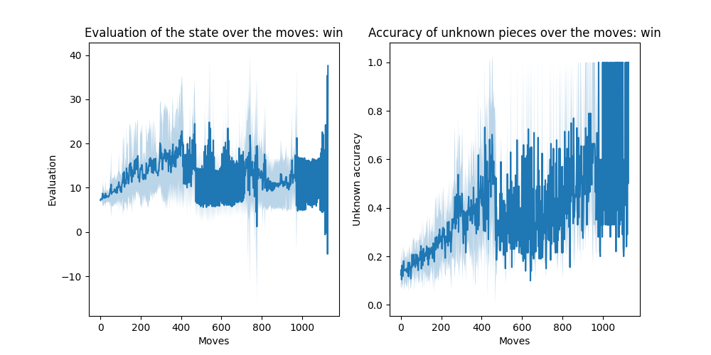
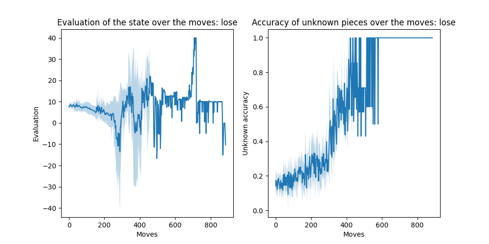

# Changement: generate_with_stats/
## Evaluation of the state over the moves: win

## Evaluation of the state over the moves: lose

## Win/Draw/Lose versus the bots

| ... | custom |
| --- | --- |
| hunter | 0/40/60 |
| asmodeus | 40/20/40 |
| basic | 80/0/20 |
| rnad | 100/0/0 |
| mcts | 100/0/0 |
## Other miscellanous stats versus the bots

| custom | Nbr Games | Avg_time | Avg_moves |
| --- | --- | --- | --- |
| hunter | 5 | 1715 | 970 |
| asmodeus | 5 | 1109 | 687 |
| basic | 5 | 593 | 423 |
| rnad | 2 | 528 | 443 |
| mcts | 2 | 1815 | 524 |
